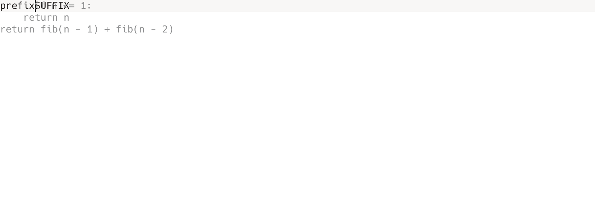
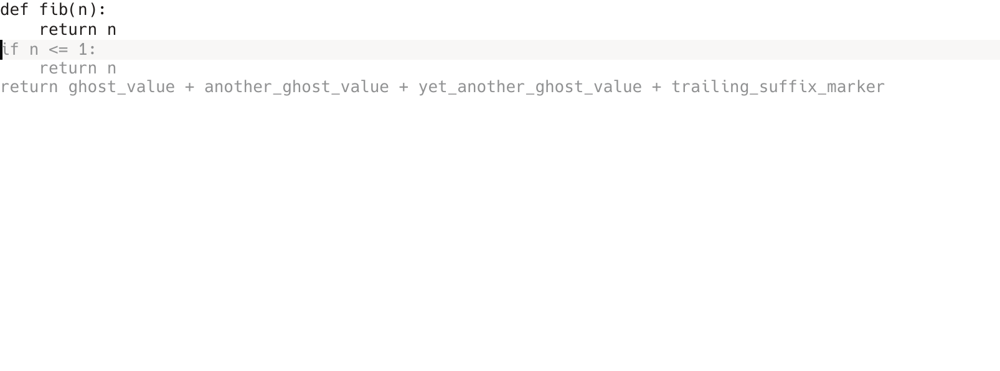

# Kate AI Inline Completion

Native AI inline completion for KDE Kate / KTextEditor.

This plugin provides:
- ghost-text inline completion rendered with a transparent overlay on `editorWidget()`
- streaming SSE completions
- `Tab` accept and `Esc` clear
- completion-popup suppression while Kate's native popup is active
- OpenAI-compatible backends
- Ollama support
- GitHub Copilot OAuth device flow with KWallet-backed token storage

## Screenshots

### Mid-line multiline ghost text



### EOF multiline ghost text



## Build

### Dependencies
- CMake 3.24+
- Qt 6.6+
- KDE Frameworks 6:
  - `KF6::CoreAddons`
  - `KF6::I18n`
  - `KF6::TextEditor`
  - `KF6::Wallet`
  - `KF6::ConfigCore`

### Configure and build

```bash
cmake -S . -B build -DBUILD_TESTING=ON
cmake --build build -j
```

### Run tests

```bash
ctest --test-dir build --output-on-failure
```

### Install

```bash
cmake --install build
```

The plugin installs into Kate's KF6 KTextEditor plugin namespace.

## Development run

Load the plugin directly from the build tree:

```bash
QT_PLUGIN_PATH=$PWD/build/bin kate
```

Open Kate, enable **AI Inline Completion**, then configure a provider in the plugin settings.

## Provider setup

### Recommended Ollama preset

Recommended preset for day-to-day coding:
- Provider: `Ollama`
- Endpoint: `http://localhost:11434/v1/chat/completions`
- Model: `qwen3-coder-q4:latest`
- Prompt template: `FIM v3`

A remote Ollama server uses the same path shape:

```text
http://<host>:11434/v1/chat/completions
```

### OpenAI-compatible backend

Use a streaming chat-completions endpoint and save the API key into KWallet from the settings page.

Typical fields:
- Provider: `OpenAI-compatible`
- Endpoint: `https://api.openai.com/v1/chat/completions`
- Model: `gpt-4o-mini`

### GitHub Copilot OAuth

1. Choose **GitHub Copilot (OAuth)**.
2. Click **Sign in**.
3. Open the verification URL, enter the device code, and authorize the session.
4. Return to Kate after the status changes to signed in.

Copilot uses the fixed Codex completions endpoint and stores the GitHub OAuth token in KWallet.

## Interaction model

### Shortcuts
- `Tab`: accept the full suggestion
- `Ctrl+Alt+Shift+Right`: accept the next word
- `Ctrl+Alt+Shift+L`: accept the next line
- `Esc`: clear the suggestion

### Runtime behavior
- The first ghost line starts at the exact cursor x position.
- Following ghost lines align to the text area left edge.
- Suggestions stay view-local and keep the document buffer unchanged until acceptance.
- Overlay rendering tracks the active view font and repaints on scroll, resize, and config changes.
- The **Suppress AI suggestion while completion popup is active** checkbox keeps Kate's native completion popup in control.

## Smoke test

The repository includes a small CLI for verifying OpenAI-compatible streaming:

```bash
./build/bin/kateaiinlinecompletion_ollama_smoke_test \
  --endpoint http://localhost:11434/v1/chat/completions \
  --model qwen3-coder-q4:latest \
  --prompt "Complete a Python function that returns fibonacci(n)."
```

## Prompt evaluation harness

The project includes a regression harness for HumanEval-Infilling and SAFIM.

Install Python dependencies:

```bash
python -m venv .venv
. .venv/bin/activate
pip install -r tools/eval/requirements.txt
```

Example run:

```bash
python tools/eval/kate_ai_eval.py humaneval \
  --endpoint http://localhost:11434/v1/chat/completions \
  --model qwen3-coder-q4:latest \
  --prompt-template fim_v3 \
  --benchmark single-line \
  --limit-tasks 20
```

The execution-based evaluation path is containerized under `tools/eval/docker/`.

## Key paths
- Plugin sources: `src/`
- Tests: `autotests/`
- Design logs: `docs/plans/`
- Evaluation harness: `tools/eval/`
- Screenshot assets: `docs/assets/`
