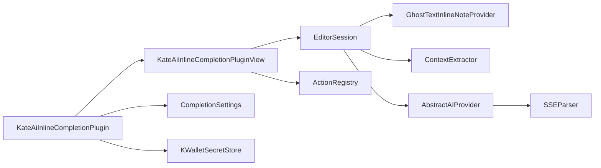
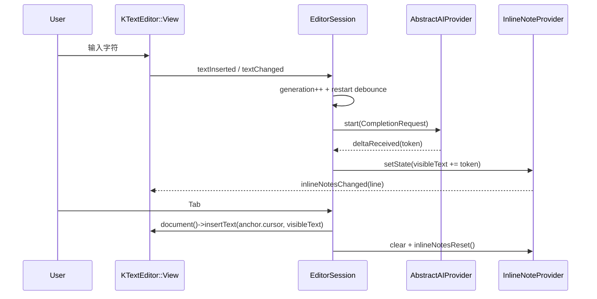

# Design Log #1 — Kate AI Inline Completion

- Date: 2026-04-19
- Status: Proposed
- Scope: 总体架构 + Phase 2 MVP 落地路径
- Target: KDE Kate / KTextEditor, C++17+, Qt 6, KDE Frameworks 6.20+

## Background

当前仓库只有一份技术调研报告：`针对开发-KDE-Kate-编辑器的-AI-辅助编程插件技术调研报告.md`。
本设计日志把报告收敛为可执行工程方案，并给出首轮文件布局、类型签名、状态机、验证规则与测试计划。

已核对的官方资料给出三条关键事实：

1. Kate 插件采用 **Plugin 单例 + PluginView 按 MainWindow 实例化** 的结构，`createView(KTextEditor::MainWindow *)` 是主入口。
2. `KTextEditor::View` 提供 `registerInlineNoteProvider()`、`unregisterInlineNoteProvider()`、`textInserted`、`isCompletionActive()`、`editorWidget()` 等能力，适合做内联渲染、按键拦截与补全互斥。
3. `QNetworkReply` 是顺序读取设备；`readyRead()` 适合接流式字节；`abort()` 会终止请求；销毁时机采用 `deleteLater()`。

这三点决定了本插件的骨架：**Kate 原生插件 + 每个编辑视图独立会话 + InlineNoteProvider 幽灵文字 + SSE 流式网络层**。

## Problem

目标体验：用户在 Kate 中输入代码后，编辑器在光标处显示低对比度幽灵文字；模型持续流式补全；用户按 `Tab` 接受整段建议；Kate 原生语义补全仍保持主导地位。

核心工程问题有五个：

1. **多窗口、多视图生命周期**：Kate 会同时存在多个 `MainWindow` 与多个 `View`。
2. **渲染隔离**：幽灵文字需要存在于 View 层，文档缓冲区始终保持真实文本。
3. **请求流控**：高频输入场景需要防抖、请求替换、旧请求终止、SSE 增量刷新。
4. **建议一致性**：任何建议都要绑定光标锚点与本地代次，避免陈旧建议写回错误位置。
5. **协同补全**：Kate 原生 completion popup 可见时，AI 建议进入 suppress 状态。

## Questions and Answers

### Q1. 第一版设计日志覆盖到哪个粒度？
**A1.** 本日志覆盖完整架构；首个实现里程碑聚焦 Phase 2 MVP：当前文档上下文、单行幽灵文字、SSE 流、`Tab` 接受。

### Q2. Alpha 版本先接哪类后端？
**A2.** Provider 抽象从第一天就建立；Phase 2 先接 OpenAI-compatible SSE 端点；Phase 3 扩展 Ollama。

### Q3. 多行建议在什么阶段交付？
**A3.** Phase 2 聚焦单锚点、单行尾幽灵文字；Phase 3 扩展跨行渲染与逐词接受。

### Q4. 插件设置页如何暴露？
**A4.** 通过 `KTextEditor::Plugin::configPages()` / `configPage()` 提供标准配置页；敏感凭据走 `KWallet::Wallet`。

### Q5. 项目级上下文从哪个阶段开始？
**A5.** Phase 2 使用当前文档 FIM；Phase 3 接入打开标签页与 Kate Project / 符号索引增强。

### Q6. 最低框架版本选多少？
**A6.** 设计以 **KF6 6.20+** 为基线。这样可以稳定使用 `editorWidget()`，按键事件挂载点更清晰。

## Design

### 1. 文件布局

```text
CMakeLists.txt
plugin.json
src/
  plugin/
    KateAiInlineCompletionPlugin.h
    KateAiInlineCompletionPlugin.cpp
    KateAiInlineCompletionPluginView.h
    KateAiInlineCompletionPluginView.cpp
  session/
    EditorSession.h
    EditorSession.cpp
    GhostTextState.h
  render/
    GhostTextInlineNoteProvider.h
    GhostTextInlineNoteProvider.cpp
  network/
    AbstractAIProvider.h
    OpenAICompatibleProvider.h
    OpenAICompatibleProvider.cpp
    OllamaProvider.h
    OllamaProvider.cpp
    SSEParser.h
    SSEParser.cpp
  context/
    ContextExtractor.h
    ContextExtractor.cpp
  settings/
    CompletionSettings.h
    CompletionSettings.cpp
    SecretStore.h
    KWalletSecretStore.h
    KWalletSecretStore.cpp
    KateAiConfigPage.h
    KateAiConfigPage.cpp
  actions/
    ActionRegistry.h
    ActionRegistry.cpp
autotests/
  SSEParserTest.cpp
  CompletionSettingsTest.cpp
  GhostTextInlineNoteProviderTest.cpp
  EditorSessionTest.cpp
docs/
  plans/
    2026-04-19-kate-ai-inline-completion-design.md
```

### 2. 模块职责

- `KateAiInlineCompletionPlugin`：全局配置入口、ConfigPage 工厂、Provider 工厂。
- `KateAiInlineCompletionPluginView`：每个 `MainWindow` 一份；管理当前窗口下所有 `EditorSession`。
- `EditorSession`：每个 `KTextEditor::View` 一份；持有防抖、上下文提取、请求状态、按键过滤、建议状态。
- `GhostTextInlineNoteProvider`：把 `GhostTextState` 渲染为 InlineNote。
- `AbstractAIProvider`：统一流式 API；实现 OpenAI-compatible 与 Ollama。
- `SSEParser`：把 `readyRead()` 字节流切成事件并输出 token delta。
- `ContextExtractor`：收集 prefix/suffix、语言模式、缩进、打开标签页摘要。
- `ActionRegistry`：注册启停补全、接受建议、丢弃建议等动作。

### 3. 类关系



### 4. 关键类型与签名

```cpp
struct SuggestionAnchor {
    QPointer<KTextEditor::View> view;
    KTextEditor::Cursor cursor;
    quint64 generation = 0;
};

struct GhostTextState {
    SuggestionAnchor anchor;
    QString visibleText;
    QString acceptedPrefix;
    bool streaming = false;
    bool suppressed = false;
};

struct CompletionRequest {
    quint64 requestId = 0;
    QString language;
    QString prefix;
    QString suffix;
    QStringList relatedSnippets;
    QString model;
};

class KateAiInlineCompletionPlugin final : public KTextEditor::Plugin {
    Q_OBJECT
public:
    explicit KateAiInlineCompletionPlugin(QObject *parent, const QList<QVariant> &args = {});
    QObject *createView(KTextEditor::MainWindow *mainWindow) override;
    int configPages() const override;
    KTextEditor::ConfigPage *configPage(int number, QWidget *parent) override;
};

class KateAiInlineCompletionPluginView final : public QObject, public KXMLGUIClient {
    Q_OBJECT
public:
    KateAiInlineCompletionPluginView(KateAiInlineCompletionPlugin *plugin,
                                     KTextEditor::MainWindow *mainWindow);
private:
    void ensureSession(KTextEditor::View *view);
    void onViewChanged(KTextEditor::View *view);
};

class EditorSession final : public QObject {
    Q_OBJECT
public:
    explicit EditorSession(KTextEditor::View *view, QObject *parent = nullptr);
    bool eventFilter(QObject *watched, QEvent *event) override;
    void scheduleCompletion();
    void clearSuggestion();
    void acceptFullSuggestion();
private:
    void startRequest();
    void handleDelta(quint64 requestId, const QString &delta);
    void handleFinished(quint64 requestId);
};

class GhostTextInlineNoteProvider final : public KTextEditor::InlineNoteProvider {
    Q_OBJECT
public:
    explicit GhostTextInlineNoteProvider(QObject *parent = nullptr);
    void setState(const GhostTextState &state);
    QList<int> inlineNotes(int line) const override;
    QSize inlineNoteSize(const KTextEditor::InlineNote &note) const override;
    void paintInlineNote(const KTextEditor::InlineNote &note,
                         QPainter &painter,
                         Qt::LayoutDirection direction) const override;
};

class AbstractAIProvider : public QObject {
    Q_OBJECT
public:
    virtual ~AbstractAIProvider() = default;
    virtual quint64 start(const CompletionRequest &request) = 0;
    virtual void cancel(quint64 requestId) = 0;
signals:
    void deltaReceived(quint64 requestId, QString delta);
    void requestFinished(quint64 requestId);
    void requestFailed(quint64 requestId, QString message);
};
```

### 5. 生命周期与会话模型

`Plugin` 保存跨窗口共享配置与凭据设施。`PluginView` 与 `MainWindow` 同寿命。每个 `EditorSession` 绑定一个 `KTextEditor::View`，并把事件过滤器安装到 `view->editorWidget()`。

`EditorSession` 持有：

- `QPointer<KTextEditor::View> m_view`
- `QTimer m_debounceTimer`
- `GhostTextInlineNoteProvider m_noteProvider`
- `std::unique_ptr<AbstractAIProvider> m_provider`
- `GhostTextState m_state`
- `quint64 m_generation`
- `quint64 m_activeRequestId`

代次规则：任何输入、光标移动、视图切换、失焦、补全弹窗激活、请求切换，都令 `m_generation++`。建议只在 `anchor.generation == m_generation` 且 `anchor.cursor == view->cursorPosition()` 时可见与可接受。

### 6. 事件流



### 7. 渲染设计

`GhostTextInlineNoteProvider` 只关心一份 `GhostTextState`。Phase 2 只在锚点所在行返回一个 inline note 列位置。`inlineNoteSize()` 用当前 `note.font()` 的字体度量计算宽度，返回高度 `note.lineHeight()`。`paintInlineNote()` 使用主题前景色与背景色混合得到低对比度颜色，并遵守 `Qt::LayoutDirection`。

更新规则：

- 锚点列未变、内容增量增长：发 `inlineNotesChanged(line)`。
- 锚点行变化、建议被清空、建议进入 suppress：发 `inlineNotesReset()`。

### 8. 输入与交互设计

`EditorSession::eventFilter()` 处理这几类键：

- `Tab`：接受完整建议。
- `Escape`：清空当前建议。
- `Ctrl+Right`：Phase 3 接入逐词接受。
- 其他可打印字符：让事件继续流向编辑器，同时由 `textInserted` 触发新一轮请求。

建议可见性规则：

1. `view->isCompletionActive()` 为真时，`suppressed = true`。
2. 存在选区时隐藏建议。
3. 输入模式变化、光标移动到新列、View 失焦时清空建议。
4. 当前视图只允许一个活动请求。

### 9. 网络与 Provider 设计

`OpenAICompatibleProvider` 与 `OllamaProvider` 都走 `QNetworkAccessManager`。请求头统一包含：

- `Content-Type: application/json`
- `Accept: text/event-stream`

`SSEParser` 保存内部缓冲区，按 `\n\n` 切事件块，再按行提取 `data:` 载荷。解析结果分三类：

- `deltaText`
- `done`
- `errorMessage`

Provider 规则：

- 新请求启动前取消本 session 的旧请求。
- `cancel(requestId)` 调用 `reply->abort()`，收尾阶段调用 `reply->deleteLater()`。
- 任何跨线程 UI 改动都回到主线程信号槽。

### 10. 上下文提取设计

Phase 2 的 `ContextExtractor` 输出当前文档 FIM：

- `prefix`: 光标前字符窗口
- `suffix`: 光标后字符窗口
- `language`: `document()->highlightingMode()`
- `indentation`: 当前行缩进宽度与软制表符策略

Phase 2 默认预算：

- `prefixChars = 12000`
- `suffixChars = 3000`
- `relatedSnippets = 0`

Phase 3 增加：

- 当前窗口打开标签页的短摘要
- 项目符号定义片段
- 最近活跃文档片段

### 11. 设置与验证规则

```cpp
struct CompletionSettings {
    bool enabled = true;
    int debounceMs = 180;
    int maxPrefixChars = 12000;
    int maxSuffixChars = 3000;
    QString provider = "openai-compatible";
    QUrl endpoint;
    QString model;
    bool suppressWhenCompletionPopupVisible = true;
};
```

验证规则：

- `debounceMs` 范围：`50..1000`
- `maxPrefixChars` 范围：`1000..20000`
- `maxSuffixChars` 范围：`0..8000`
- `endpoint`：绝对 URL，scheme 为 `http` 或 `https`
- `model`：非空
- 密钥：保存在 `KWallet::Wallet`，配置文件只保存引用键名

### 12. 安全与凭据

密钥存储策略：

- 文件配置保存 `provider`、`endpoint`、`model`、行为开关。
- `KWalletSecretStore` 保存真实 token，folder 名建议：`kate-ai-inline-completion`。
- Provider 在请求前通过 `SecretStore` 读取 token，运行期只保留在内存对象中。

## Implementation Plan

### Phase 1 — 工程骨架与测试底座

1. 建立 `CMakeLists.txt`、`plugin.json`、`src/`、`autotests/`。
2. 依赖：`KF6::CoreAddons`、`KF6::I18n`、`KF6::TextEditor`、`KF6::Wallet`、`Qt6::Network`、`Qt6::Widgets`、`Qt6::Test`。
3. 创建空插件并让 Kate 识别。
4. 建立 QtTest 运行入口。

### Phase 2 — MVP 端到端

1. 先写 `SSEParserTest.cpp` 与 `CompletionSettingsTest.cpp`。
2. 实现 `OpenAICompatibleProvider` + `SSEParser`。
3. 实现 `GhostTextState` + `GhostTextInlineNoteProvider`。
4. 实现 `EditorSession`：防抖、请求启动、增量渲染、`Tab` 接受、`Esc` 清空。
5. 用 mock provider 驱动 `EditorSessionTest.cpp`，验证：
   - token 增量可见
   - `Tab` 写回文档
   - 光标变化后建议清空
   - completion popup 激活时 suppress 生效

### Phase 3 — 本地模型与上下文增强

1. 加入 `OllamaProvider`。
2. 接入 `ContextExtractor` 多文件增强。
3. 增加多行建议与逐词接受。
4. 增加 ActionRegistry 与快捷键映射。

### Phase 4 — 产品化

1. 增加 ConfigPage 与 KWallet 集成测试。
2. 做长时运行、请求取消、内存生命周期审计。
3. 补齐 README、安装说明、开发说明。

## Examples

### ✅ 推荐模式：视图层渲染，接受时一次写回

```cpp
void EditorSession::acceptFullSuggestion()
{
    if (!m_view || m_state.visibleText.isEmpty()) {
        return;
    }

    m_view->document()->insertText(m_state.anchor.cursor, m_state.visibleText);
    clearSuggestion();
}
```

### ❌ 高风险模式：把建议先写入 Document 再染成灰色

```cpp
// 这种做法会污染撤销栈、修改状态与下游工具链。
document->insertText(cursor, ghostText);
```

### ✅ 推荐模式：SSE 增量解析后只刷新当前行

```cpp
connect(reply, &QNetworkReply::readyRead, this, [this, requestId, reply] {
    const QByteArray bytes = reply->readAll();
    for (const auto &event : m_parser.feed(bytes)) {
        if (event.kind == SSEEvent::DeltaText) {
            Q_EMIT deltaReceived(requestId, event.text);
        }
    }
});
```

### ✅ 推荐 Prompt 结构

```text
// Current File: src/foo.cpp
// Language: C++
// Cursor: line 42, column 17
<|fim_prefix|>
...prefix...
<|fim_suffix|>
...suffix...
```

## Trade-offs

1. **PluginView + EditorSession 映射**
   - 收益：生命周期清晰，适合多窗口。
   - 成本：对象数量增加，清理逻辑需要严格。

2. **InlineNoteProvider 单独渲染**
   - 收益：文档缓冲区保持纯净，撤销栈稳定。
   - 成本：多行建议需要额外布局策略。

3. **Provider 抽象从第一天建立**
   - 收益：Phase 3 接入 Ollama 成本低。
   - 成本：MVP 初期需要多写一层接口。

4. **Phase 2 聚焦单行建议**
   - 收益：端到端链路短，验证速度快。
   - 成本：早期版本的表达力集中在短补全与单行续写。

## References

- `针对开发-KDE-Kate-编辑器的-AI-辅助编程插件技术调研报告.md`
- KDE Developer: Kate plugin tutorial
- KDE API: `KTextEditor::View`, `KTextEditor::InlineNoteProvider`, `KTextEditor::Plugin`, `KTextEditor::ConfigPage`
- Qt API: `QNetworkReply`
- KDE API: `KWallet::Wallet`

## Implementation Results

### Phase 1 — 工程骨架与测试底座（已落地）

- 新增工程骨架：`CMakeLists.txt`、`src/`、`autotests/`、`.gitignore`。
- 新增可加载插件：`kateaiinlinecompletion`（安装命名空间：`kf6/ktexteditor`）。
  - 入口类：`src/plugin/KateAiInlineCompletionPlugin.*`
  - MainWindow 视图类：`src/plugin/KateAiInlineCompletionPluginView.*`
  - 插件元数据：`src/plugin/kateaiinlinecompletion.json`
- 新增配置与凭据设施：
  - 设置结构与 KConfig 序列化：`src/settings/CompletionSettings.*`
  - KWallet 密钥存取：`src/settings/KWalletSecretStore.*`
  - Kate 配置页：`src/settings/KateAiConfigPage.*`
- 单元测试：
  - `autotests/CompletionSettingsTest.cpp`
  - `autotests/SSEParserTest.cpp`

构建与测试记录：

```bash
cmake -B build -S . -GNinja
cmake --build build
ctest --test-dir build --output-on-failure
```

测试结果：3/3 passed。

偏离点记录：

- CMake 依赖解析采用 `find_package(KF6Config ...)` 来提供 `KF6::ConfigCore` 目标，与系统安装的 CMake 包命名保持一致。
- 插件安装命名空间采用 `kf6/ktexteditor`，与系统插件目录布局 `/usr/lib64/qt6/plugins/kf6/ktexteditor` 保持一致。

### Phase 2 — MVP 主链路（已落地：SSE/Provider/Session/渲染骨架）

- SSE framing：`src/network/SSEParser.*`（静态库：`kateaiinlinecompletion_sse`）。
- OpenAI-compatible 流式 Provider：`src/network/OpenAICompatibleProvider.*`（解析 `choices[0].delta.content`，识别 `[DONE]`）。
- 幽灵文字渲染：`src/render/GhostTextInlineNoteProvider.*`（单行渲染）。
- 视图会话：`src/session/EditorSession.*` + `src/session/GhostTextState.h`。
- PluginView 在 `viewChanged` 时创建 session，并复用 `QNetworkAccessManager` 与 `KWalletSecretStore`。

当前交互支持：

- `textInserted`/`cursorPositionChanged` 触发防抖请求。
- SSE token 增量更新幽灵文字。
- `Tab` 接受并写回 `KTextEditor::Document::insertText`。
- `Esc` 清理建议。
- completion popup 可见时按设置抑制请求与渲染。

单元测试新增：

- `autotests/SSEParserTest.cpp` 覆盖 LF/CRLF、分块输入、多行 `data:` 拼接。

联调验证（远端 Ollama OpenAI-compatible）：

- 目标：`http://192.168.62.31:11434/v1/chat/completions`
- 新增 CLI：`tools/ollama_smoke_test.cpp`（产物：`build/bin/kateaiinlinecompletion_ollama_smoke_test`）
- 实测命令：
  - `./build/bin/kateaiinlinecompletion_ollama_smoke_test --endpoint http://192.168.62.31:11434/v1/chat/completions --model codestral:latest --prompt "Write a single-line Python program that prints hello."`
- 实测输出：`print("hello")` + 正常结束信号
