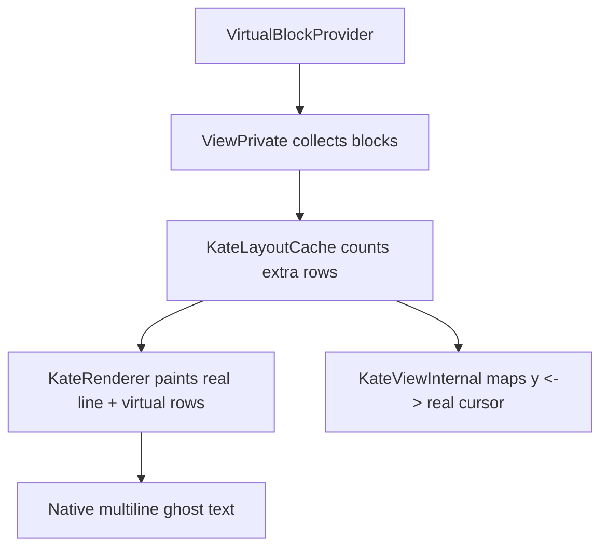
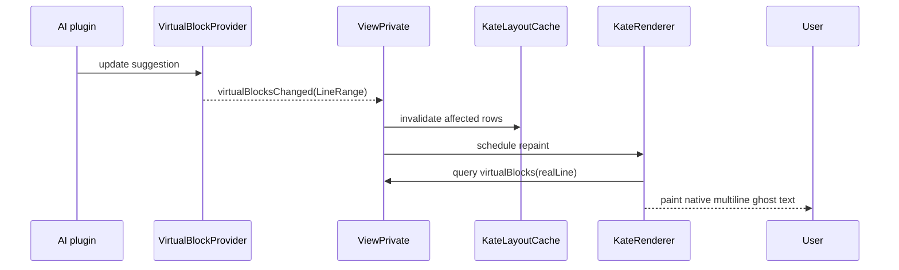

# Design Log: KTextEditor VirtualBlockProvider for Native Multiline Ghost Text

Date: 2026-04-20

## Background
当前 Kate AI Inline Completion 已经验证了两件关键事实：
1. `KTextEditor::InlineNoteProvider` 很适合单行 ghost text。
2. 多行 ghost text 需要“虚拟行参与垂直布局”的能力。

真实渲染实验已经落地在 `autotests/InlineNoteRenderingExperimentTest.cpp`。实验结果显示：
- `inlineNoteSize()` 请求超过 `note.lineHeight()` 的高度时，可见区域仍然落在单行高度内。
- `paintInlineNote()` 在同一个 note 内绘制第二、第三条色带时，Kate 的渲染会把它们裁剪掉。
- 给连续多个真实行分别返回 notes，可以形成“多条真实行各自带附注”的效果。

这个结果与 KTextEditor 文档一致。`src/include/ktexteditor/inlinenoteprovider.h` 已经写明：`inlineNoteSize()` 的高度应当以 `note.lineHeight()` 为界，因为绘制路径按行高裁剪。当前的多行 overlay 方案已经可用；用户对它的期望更高，目标是拿到与 Kate 正文一致的字形、hinting、HiDPI 与滚动行为。这个目标最适合通过 frameworks 层的新布局原语来实现。

## Problem
KTextEditor 当前公开 API 里有三类相关能力：
- `InlineNoteProvider`：给一条真实行插入水平空间。
- `TextHintProvider`：给悬停位置显示提示。
- `CodeCompletionModel`：给补全弹窗提供候选项。

这三类 API 都服务于已有的视图模型。它们共同受益于 Kate 自身的绘制与交互路径，同时它们也沿用当前的垂直布局模型：一条可见 view line 来自真实文档行或动态换行。`src/render/katelayoutcache.cpp`、`src/render/katelinelayout.cpp`、`src/render/katetextlayout.cpp` 当前正是围绕这个模型组织缓存与坐标映射。

多行 AI ghost text 需要新的能力：
- 在某个锚点后面插入若干条 view-local、ephemeral、non-buffer 的虚拟行。
- 让滚动条高度、`cursorToCoordinate()`、鼠标 hit test、当前行高亮、字体 shaping 与正文保持一致。
- 保持文档 buffer、undo/redo、保存、搜索与打印路径围绕真实文本工作。

这个需求天然属于 KTextEditor frameworks 层。因为它要求 `src/view/kateview.cpp` 的 provider 注册机制、`src/render/katelayoutcache.cpp` 的 view line 计数、`src/render/katerenderer.cpp` 的文本绘制，以及 `src/view/kateviewinternal.cpp` 的坐标映射一起工作。

## Questions and Answers
### Q1. 应该扩展 `InlineNoteProvider`，还是新增一个 provider？
A1. 推荐新增 provider，名称暂定 `VirtualBlockProvider`。

原因：
- `InlineNoteProvider` 的语义已经稳定，核心价值是“在一条真实行里创建水平空间”。
- 多行 ghost text 属于“虚拟块参与垂直布局”，它需要新的数据模型和新的缓存失效逻辑。
- 新 provider 可以复用 `register/unregister + changed/reset` 这一套 Kate 已经成熟的视图扩展模式，同时保持 InlineNote API 简洁。

### Q2. API 名称应选 `VirtualLineProvider` 还是 `VirtualBlockProvider`？
A2. 推荐 `VirtualBlockProvider`。

原因：
- AI 补全天然以“块”为单位：第一行常常接到当前行后面，后续行落到下方。
- `QStringList lines` 很适合表达空行、缩进、尾行大括号等实际代码结构。
- 后续若要扩展 hover、click 或 attribute spans，block 语义更自然。

### Q3. Phase 1 的范围怎样收敛？
A3. Phase 1 先支持“行尾锚点”的只读虚拟块。

具体规则：
- `anchor.column` 落在真实行末尾。
- `lines[0]` 继续按 inline continuation 画在锚点行末尾。
- `lines[1..]` 作为虚拟行插入到锚点真实行之后。
- 键盘光标与鼠标命中默认采用 `Skip` 行为，视图交互沿真实文本推进。

这个范围已经覆盖多行代码生成的主场景，也让内部实现保持清晰。Phase 2 再扩展任意列锚点。

## Design
### 1) Public API
新增头文件：`src/include/ktexteditor/virtualblockprovider.h`

```cpp
namespace KTextEditor
{

enum class VirtualBlockCursorBehavior {
    Skip,
};

class KTEXTEDITOR_EXPORT VirtualBlock
{
public:
    VirtualBlock();
    VirtualBlock(Cursor anchor,
                 QStringList lines,
                 Attribute::Ptr attribute = {},
                 int priority = 0,
                 VirtualBlockCursorBehavior cursorBehavior = VirtualBlockCursorBehavior::Skip);

    [[nodiscard]] bool isValid() const;
    [[nodiscard]] const Cursor &anchor() const;
    [[nodiscard]] const QStringList &lines() const;
    [[nodiscard]] const Attribute::Ptr &attribute() const;
    [[nodiscard]] int priority() const;
    [[nodiscard]] VirtualBlockCursorBehavior cursorBehavior() const;
};

class KTEXTEDITOR_EXPORT VirtualBlockProvider : public QObject
{
    Q_OBJECT
public:
    using QObject::QObject;
    ~VirtualBlockProvider() override;

    virtual QList<VirtualBlock> virtualBlocks(const View *view,
                                              LineRange visibleLines) const = 0;

Q_SIGNALS:
    void virtualBlocksReset();
    void virtualBlocksChanged(LineRange lines);
};

}
```

`src/include/ktexteditor/view.h` 增加：

```cpp
virtual void registerVirtualBlockProvider(KTextEditor::VirtualBlockProvider *provider) = 0;
virtual void unregisterVirtualBlockProvider(KTextEditor::VirtualBlockProvider *provider) = 0;
```

### 2) Validation rules
`VirtualBlock::isValid()` 与 `ViewPrivate` 的 provider 收集路径共同遵守这些规则：
- `anchor` 有效。
- `lines` 非空。
- 每个 `QString` 元素代表一条逻辑虚拟行，元素内部不含 `\n`。
- `priority` 越大越优先。
- Phase 1 只接受“行尾锚点”：`anchor.column == document->line(anchor.line()).size()`。
- 同一锚点若收到多个 blocks，视图按 `priority` 降序和 provider 注册顺序升序决议，取最前面的一个 block。

这些规则让 renderer、cache 与 hit-test 拥有稳定输入。

### 3) Semantics
`lines[0]` 与 `lines[1..]` 的语义如下：
- `lines[0]`：画在锚点真实行的末尾，行为与 inline completion 的首行 continuation 一致。
- `lines[1..]`：作为虚拟 view lines 出现在锚点真实行之后、下一个真实行之前。

空字符串是合法行，空字符串会形成可见的空白虚拟行。



### 4) Internal model
推荐新增内部数据结构：`src/view/virtualblockdata.h`

```cpp
class KateVirtualBlockData
{
public:
    KTextEditor::VirtualBlockProvider *provider = nullptr;
    const KTextEditor::View *view = nullptr;
    KTextEditor::Cursor anchor = KTextEditor::Cursor::invalid();
    QStringList lines;
    KTextEditor::Attribute::Ptr attribute;
    int priority = 0;
    KTextEditor::VirtualBlockCursorBehavior cursorBehavior = KTextEditor::VirtualBlockCursorBehavior::Skip;
};
```

`src/view/kateview.h` / `src/view/kateview.cpp` 参照 InlineNote 的模式，增加：
- `std::vector<KTextEditor::VirtualBlockProvider *> m_virtualBlockProviders;`
- `registerVirtualBlockProvider()` / `unregisterVirtualBlockProvider()`
- `QVarLengthArray<KateVirtualBlockData, 4> virtualBlocks(int line) const;`
- `virtualBlocksReset()` / `virtualBlocksLineRangeChanged(LineRange)`

这里建议沿用 InlineNote 的 provider 管线。`src/view/kateview.cpp` 当前已经有 `registerInlineNoteProvider()` 与 `inlineNotes(int line)`。新扩展与它同构，代码阅读与后续维护都会更顺。

### 5) Layout integration
Phase 1 采用“每个真实行增加额外 view line 计数”的方式接入布局缓存，保留 `KateTextLayout` 与 `KateLineLayout` 的主体模型。

核心改动点：
- `src/render/katelayoutcache.h/.cpp`
  - 新增 `int virtualBlockLineCount(int realLine) const;`
  - 新增 `int totalViewLineCount(int realLine) const;`
  - 更新 `viewLineCount(int realLine)` 的内部调用点，让滚动与可见区计算使用 `totalViewLineCount`。
- `src/view/kateviewinternal.h/.cpp`
  - `lineToY(int viewLine)`、`scrollLines(int line)`、`cursorToCoordinate()`、`coordinatesToCursor()` 通过新的映射函数穿过虚拟行。

Phase 1 的关键简化：虚拟行总是追加在锚点真实行的最后一个 real view line 之后。这样 `KateLineLayout` 的 wrapped text 结构保持稳定，额外 view lines 通过外层计数补上。这个模型非常适合行尾锚点。

### 6) Rendering integration
`src/render/katerenderer.cpp` 当前已经在 `paintTextLine` 路径里画 InlineNote，并按 `lineHeight() * range->viewLineCount()` 平移到下一个真实行。这里正好是接入点。

推荐新增一个局部绘制步骤：
- 先按现有逻辑画真实行与 `lines[0]` 对应的 inline continuation。
- 再读取 `m_view->virtualBlocks(range->line())` 决议后的 block。
- 用 Kate 当前字体、tab 宽度与 `Attribute` 颜色画出 `lines[1..]`。
- 渲染完毕后，把这几条虚拟行的高度计入本次 `paint.translate(0, ...)`。

这样可以确保：
- 字形 shaping、hinting、HiDPI 行为沿用 KateRenderer。
- 当前主题色、selection 前景、字体缩放与正文一致。
- ghost text 的 dim style 由 `Attribute` 决定，插件只负责提供内容。

### 7) Cursor / mouse behavior
Phase 1 的 `VirtualBlockCursorBehavior::Skip` 语义：
- 上下移动时，光标在真实文本之间移动。
- 视图坐标落在虚拟行区间时，`coordinatesToCursor()` 映射到相邻真实位置。
- 选区、搜索、打印、保存继续围绕真实文档范围工作。

推荐策略：
- 点击虚拟行上半区时映射到锚点真实行末尾。
- 点击虚拟行下半区时映射到下一真实行行首；若下一真实行不存在，则映射回锚点末尾。

这个交互对 AI ghost text 足够稳定，也保留后续扩展 hover/click action 的空间。

### 8) Folding, dyn-wrap, zoom
Phase 1 规则：
- 锚点真实行被 folding 隐藏时，virtual block 同步隐藏。
- dyn-wrap 继续作用于真实文本；virtual lines 按 provider 给出的每个 `QString` 逐行渲染，Phase 1 维持“每个元素对应一条虚拟 view line”。
- 字体缩放、tab-width、palette 变化时，virtual blocks 与真实文本一起重算布局与重绘。

`src/view/kateviewinternal.cpp` 与 `src/render/katerenderer.cpp` 已经拥有这些刷新入口，virtual blocks 只需要接入相同的失效路径。

## Implementation Plan
### Phase 1: Public API + provider wiring
Files:
- Create: `src/include/ktexteditor/virtualblockprovider.h`
- Modify: `src/include/ktexteditor/view.h`
- Modify: `src/view/kateview.h`
- Modify: `src/view/kateview.cpp`
- Create: `src/view/virtualblockdata.h`

Tasks:
1. 新增 `VirtualBlock` / `VirtualBlockProvider` public API。
2. 在 `ViewPrivate` 加入 provider 注册、注销、收集与 changed/reset 信号处理。
3. 增加一组基础单测，验证 provider 注册、优先级决议与输入校验。

### Phase 2: Layout counting + coordinate mapping
Files:
- Modify: `src/render/katelayoutcache.h`
- Modify: `src/render/katelayoutcache.cpp`
- Modify: `src/view/kateviewinternal.h`
- Modify: `src/view/kateviewinternal.cpp`

Tasks:
1. 给每个真实行引入 `virtualBlockLineCount()`。
2. 让 view line 计数、滚动高度与坐标映射通过 `totalViewLineCount()` 工作。
3. 为行尾锚点场景补齐 `cursorToCoordinate()` / `coordinatesToCursor()` 的回归测试。

### Phase 3: Renderer integration
Files:
- Modify: `src/render/katerenderer.h`
- Modify: `src/render/katerenderer.cpp`

Tasks:
1. 在真实行绘制后追加 `lines[1..]` 的原生文本渲染。
2. 让 `Attribute` 决定 ghost 的颜色与样式。
3. 保持 current line highlight、selection 与 theme 切换的现有路径。

### Phase 4: Screenshot tests + sample integration
Files:
- Create: `autotests/src/view/virtualblockrenderingtest.cpp`
- Optionally create: `autotests/src/view/virtualblockinteractiontest.cpp`

Tasks:
1. 复用当前插件实验的抓图思路，直接验证多行虚拟行可见。
2. 验证滚动、folding、zoom、tab-width 变化后的布局稳定性。
3. 用 Kate AI Inline Completion 作为外部 sample plugin 做手工联调。

## Examples
### Example 1: Copilot multiline completion
真实文本：
```cpp
if (ready) {
    work();
}
```

锚点：`Cursor(0, 11)`，也就是第一行末尾。

provider 返回：
```cpp
VirtualBlock(
    Cursor(0, 11),
    {
        "",
        "    auto result = compute();",
        "    return result;"
    },
    ghostAttribute,
    100
)
```

视图表现：
- 第一行末尾保持 inline continuation 语义。
- 第二、第三条字符串作为虚拟行出现在第一行之后。
- 第二个真实行 `    work();` 被整体下推两行。

### Example 2: blank line inside block
```cpp
VirtualBlock(
    Cursor(5, doc->line(5).size()),
    {
        "",
        "if (ok) {",
        "",
        "    finish();",
        "}"
    },
    ghostAttribute,
    100
)
```

这个 block 会在 `if (ok) {` 与 `finish();` 之间产生一条空白虚拟行。

### Example 3: conflict resolution
- Provider A priority = 50
- Provider B priority = 100
- 同一锚点同时返回 block

视图选择 Provider B 的 block。这个规则可以让 AI 建议优先于弱提示类 provider。

## Trade-offs
- 新增 frameworks API 的收益很集中：KateRenderer 直接绘制虚拟行，视觉一致性、HiDPI、字体 shaping 与滚动体验都会提升。
- Phase 1 采用“行尾锚点 + 追加虚拟行”的模型，范围清晰，适合快速交付 AI 多行 ghost text 的主场景。
- 任意列锚点、hover action、BiDi 细粒度命中、accessibility 朗读与打印控制适合作为 Phase 2/3 扩展点。
- 这个扩展会进入 `src/include/ktexteditor/`、`src/view/` 与 `src/render/` 三个层次，合并成本高于插件内 workaround，长期收益也更高。



## Implementation Results
### Scope implemented
本轮完成了设计里的 Phase 1：public API + provider wiring。

变更文件：
- `/tmp/ktexteditor-upstream/src/include/ktexteditor/virtualblockprovider.h`
- `/tmp/ktexteditor-upstream/src/include/CMakeLists.txt`
- `/tmp/ktexteditor-upstream/src/include/ktexteditor/view.h`
- `/tmp/ktexteditor-upstream/src/utils/ktexteditor.cpp`
- `/tmp/ktexteditor-upstream/src/view/virtualblockdata.h`
- `/tmp/ktexteditor-upstream/src/view/kateview.h`
- `/tmp/ktexteditor-upstream/src/view/kateview.cpp`
- `/tmp/ktexteditor-upstream/autotests/CMakeLists.txt`
- `/tmp/ktexteditor-upstream/autotests/src/virtualblock_test.h`
- `/tmp/ktexteditor-upstream/autotests/src/virtualblock_test.cpp`

### Landed semantics
- 新 public API：`VirtualBlockCursorBehavior`、`VirtualBlock`、`VirtualBlockProvider`。
- 新 `View` API：`registerVirtualBlockProvider()` / `unregisterVirtualBlockProvider()`。
- `ViewPrivate::virtualBlocks(int line) const` 已接通 provider 查询与 Phase 1 决议规则：
  - 过滤 `!block.isValid()`
  - 过滤锚点行不匹配的 block
  - 过滤非“行尾锚点”的 block
  - 对同一真实行选择单个 winner
  - priority 高者优先
  - priority 相同按 provider 注册顺序优先
- `virtualBlocksReset()` / `virtualBlocksLineRangeChanged()` 已接通 `tagLines()`，后续 renderer/layout phase 可直接复用这条失效路径。

### Tests
新增 `virtualblock_test`，覆盖：
- provider registration + query path
- priority resolution
- invalid block filtering
- unregister 后结果清空

### Verification
本机系统库版本低于 upstream 当前 `CMakeLists.txt` 的最低门槛：
- system ECM = 6.22.0
- upstream requires ECM/KF deps = 6.25.0

因此我用两个临时副本做了 RED→GREEN 验证，源码 patch 本体保持原始版本门槛不变：

1. RED 副本：`/tmp/ktexteditor-upstream-red`
   - 仅加入测试文件与 `autotests/CMakeLists.txt` 入口
   - 为了让本机能配置，临时把副本里的 version gate 降到 6.22
   - `cmake --build ... --target virtualblock_test` 失败
   - 失败原因：`ktexteditor/virtualblockprovider.h` 不存在

2. GREEN 副本：`/tmp/ktexteditor-upstream-green`
   - 基于当前 patch 后源码复制
   - 同样只在副本里临时把 version gate 降到 6.22
   - `virtualblock_test` 通过
   - 邻近回归 `kateview_test`、`inlinenote_test` 也通过

验证输出：
- `virtualblock_test`: 1/1 passed
- `kateview_test + inlinenote_test + virtualblock_test`: 3/3 passed

### Deviations
- 设计稿里把 `VirtualBlockProvider` 定义为“visible line range 查询”。Phase 1 的 `ViewPrivate::virtualBlocks(int line)` 当前按单行调用 provider：`LineRange(line, line)`。这个行为与设计兼容，也让 provider wiring 与测试更小、更稳。
- 本轮没有进入 renderer/layout 改造；`KateLayoutCache`、`KateRenderer`、`KateViewInternal` 仍留在下一阶段。