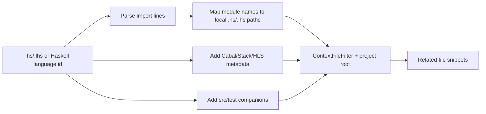

# Haskell Related Files Context Provider Design

## Background
Phase 2C added `RelatedFilesContextProvider` for repository-aware context snippets. The resolver currently handles C/C++/Qt/KDE, Python, JavaScript/TypeScript, Rust, and generic same-basename companions.

Cabal and Stack projects commonly describe components in `.cabal`, `package.yaml`, `stack.yaml`, and `cabal.project`. Haskell modules map dotted names such as `Foo.Bar` to files such as `Foo/Bar.hs` or `Foo/Bar.lhs` under source roots like `src`, `app`, and `test`.

## Problem
Haskell files need language-specific related-file discovery so completions can see nearby local modules, package metadata, and source/test companions without broad repository scans.

## Questions and Answers
- Q: Which implementation should this phase use?
  - A: Use a lightweight, deterministic resolver branch inside `RelatedFilesResolver`, matching Phase 2C constraints.
- Q: Should the resolver parse Cabal/package.yaml fully?
  - A: This phase uses standard roots and package metadata hints. Full component parsing is future work.
- Q: Should imported package modules such as `Data.Text` be included?
  - A: Only if they resolve to repository-local files under the project root. External package modules stay outside prompt context.

## Design
Add Haskell support to `src/context/RelatedFilesResolver.cpp`.

Detection:
- Treat files ending in `.hs` or `.lhs` as Haskell.
- Treat language ids containing `haskell` as Haskell.

Resolver behavior:
- Parse import lines including common forms:
  - `import Foo.Bar`
  - `import qualified Foo.Bar as Bar`
  - `import "pkg" Foo.Bar`
  - `import {-# SOURCE #-} Foo.Bar`
  - `import safe Foo.Bar`
- Convert local module names to candidate paths by replacing `.` with `/` and probing `.hs` and `.lhs` under:
  - current directory
  - project root
  - `src`, `app`, `test`, `tests`, `lib`, `library`
- Skip generated/autogen module names beginning with `Paths_`.
- Add package metadata files from the project root:
  - `*.cabal`
  - `package.yaml`
  - `stack.yaml`
  - `cabal.project`
  - `hie.yaml`
- Add source/test companions:
  - `src/Foo/Bar.hs` → `test/Foo/BarSpec.hs`, `test/Foo/BarTest.hs`, `tests/...`
  - `test/Foo/BarSpec.hs` or `test/Foo/BarTest.hs` → `src/Foo/Bar.hs` and `.lhs`

Safety:
- Reuse `CandidateAccumulator::add()` so all candidates stay local, project-confined, filtered, bounded, and deterministic.
- Keep resolver synchronous and heuristic-only.

## Implementation Plan
1. Add failing resolver tests for Haskell imports, metadata, and source/test companions.
2. Implement Haskell helper functions in `RelatedFilesResolver.cpp`.
3. Add `.hs` and `.lhs` to generic companion extensions.
4. Update this design log with implementation results.
5. Run focused resolver tests and full CTest.

## Examples
✅ `src/Foo/Bar.hs` importing `Foo.Baz` can include `src/Foo/Baz.hs`, `package.yaml`, `stack.yaml`, and `test/Foo/BarSpec.hs`.

✅ `test/Foo/BarSpec.hs` can include `src/Foo/Bar.hs`.

✅ `import qualified Data.Text as T` contributes only if `Data/Text.hs` exists inside the repository.

❌ `Paths_my_package` is skipped because Cabal/Hpack commonly generate it.

## Trade-offs
- Standard source roots cover common Cabal/Stack/Hpack layouts with minimal latency.
- Full `.cabal`/`package.yaml` parsing would improve custom layouts and adds parser complexity.
- Recursive import graph traversal could increase relevance and also increases synchronous latency.

## Implementation Results
- Added Haskell project-root markers: `*.cabal`, `package.yaml`, `cabal.project`, and `stack.yaml`.
- Added Haskell resolver branch for `.hs`, `.lhs`, and `languageId` containing `haskell`.
- Added import parsing for qualified imports, package-qualified imports, `safe`/`unsafe` imports, and `{-# SOURCE #-}` imports.
- Added local module path probing under current directory plus common roots: `src`, `app`, `test`, `tests`, `lib`, `library`, and project root.
- Added project metadata candidates: `*.cabal`, `package.yaml`, `cabal.project`, `stack.yaml`, and `hie.yaml`.
- Added source/test companion candidates for `src/Foo/Bar.hs` ↔ `test/Foo/BarSpec.hs` / `test/Foo/BarTest.hs`.
- Added `.hs` and `.lhs` generic same-basename companions.
- Added resolver tests covering local imports, metadata, `Paths_*` skipping, and source/spec companion resolution.
