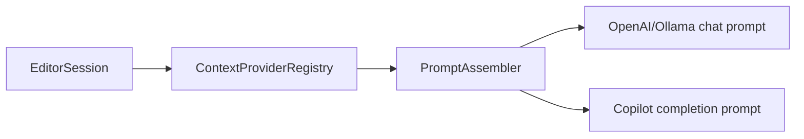

# Kate AI Phase 2 Context Hardening Design

## Background

Phase 1 added synchronous context providers and `PromptAssembler`. Phase 2A/2B/2C added recent edits, diagnostics, and related files. The current pipeline works, but default budgets can favor low-value metadata and duplicated snippets over diagnostics, recent edits, and related files.



## Problem

1. `CurrentFileContextProvider` emits four traits with provider score `100`, so `maxContextItems=6` can spend most slots on data already present in prompt metadata.
2. `RelatedFilesContextProvider` and `OpenTabsContextProvider` can emit the same file through different provider ids.
3. `PromptAssembler` appends whole blocks, so a large related-file block can be skipped even when a useful prefix fits the remaining character budget.
4. Copilot Codex receives raw context before the active-file prompt marker, which can blur related-context and active-file continuation boundaries.
5. Path/root helpers are duplicated across context providers, creating inconsistent relative paths in mixed projects.

## Questions and Answers

### Q1: Should Phase 2H-1 include the live diagnostics adapter?

Answer: Phase 2H-2 owns the live adapter. Phase 2H-1 stabilizes the shared context pipeline that diagnostics will use once populated.

### Q2: Should current-file traits be kept under a separate budget?

Answer: Remove `CurrentFileContextProvider` from the completion path. `PromptContext` and `PromptTemplate` already carry file path, language, and cursor metadata. This directly frees context item slots for semantic providers.

### Q3: Where should snippet deduplication live?

Answer: `ContextProviderRegistry` deduplicates file snippets by canonical local path after ranking. It keeps diagnostic bags and recent-edit summaries as separate semantic items because they represent different information about a file.

### Q4: How should Copilot context differ from chat-provider context?

Answer: Add a Copilot-specific rendering function in `PromptAssembler`. It comment-prefixes context lines and wraps them in explicit `BEGIN RELATED CONTEXT` / `END RELATED CONTEXT` markers before `CopilotCodexPromptBuilder` emits the active file `Path` marker.

## Design

### Shared path/project resolver

Add `src/context/ProjectContextResolver.{h,cpp}` with static helpers:

```cpp
class ProjectContextResolver final {
public:
    static QString localPathFromUri(const QString &uriOrPath);
    static QString canonicalPath(const QString &path);
    static QString findProjectRoot(const QString &path);
    static QString relativeDisplayPath(const QString &uriOrPath, const QString &projectRoot);
    static bool isWithinRoot(const QString &path, const QString &projectRoot);
};
```

The marker set includes `.git`, CMake, package, Python, Rust, and Haskell markers already used by related-file discovery.

### Registry budget and deduplication

`EditorSession` stops registering `CurrentFileContextProvider`. `ContextProviderRegistry` keeps the current provider score + importance sort, then deduplicates snippet items by canonical URI/path.

Dedup priority for snippet duplicates:

1. `related-files`
2. `open-tabs`
3. provider score / item importance fallback

Recent edit and diagnostic items stay in the result because their value differs from raw file snippets.

### PromptAssembler truncation

Replace all-or-nothing append with:

```cpp
bool appendTruncatedBlock(QString *out, const QString &block, int budget, int minUsefulChars);
```

Rules:
- append full block when it fits
- append a prefix plus `...` when at least `minUsefulChars` can fit
- preserve headers because headers carry file identity
- keep deterministic output under the same input order

### Copilot context boundaries

Add:

```cpp
static QString renderCopilotContextPrefix(const PromptContext &ctx,
                                          const QVector<ContextItem> &items,
                                          const PromptAssemblyOptions &options);
```

Rendering shape:

```text
// BEGIN RELATED CONTEXT
// File: src/foo.h
// class Foo { ... }
// END RELATED CONTEXT
// Path: src/foo.cpp
<active prefix>
```

Each context line is commentized with the active language comment prefix. This keeps completion-style continuations anchored to the active-file marker.

## Implementation Plan

1. Add focused failing tests:
   - current-file traits no longer consume completion context slots
   - duplicate related/open-tab snippets keep related-file item
   - oversized related-file block appends a truncated useful prefix
   - Copilot context renders explicit commentized boundaries
   - shared project resolver handles Haskell markers and local-file URLs
2. Implement `ProjectContextResolver` and move related/open-tabs path/root helpers to it.
3. Remove `CurrentFileContextProvider` registration from `EditorSession`; keep the class and tests for compatibility until a later cleanup.
4. Add canonical snippet deduplication to `ContextProviderRegistry`.
5. Add truncating append logic and Copilot-specific context rendering to `PromptAssembler`.
6. Update Copilot path in `EditorSession` to use `renderCopilotContextPrefix()`.
7. Run focused tests, full build, and full CTest.

## Examples

✅ With `maxContextItems=6`, diagnostics, recent edits, and related files get slots because current-file metadata is delivered through `PromptContext`.

✅ If `src/Foo.cpp` has `src/Foo.h` both open and related, the prompt includes one snippet headed as related context.

✅ A 4 KB related file with 600 remaining chars still contributes its header and first useful lines with an ellipsis.

✅ Copilot prompt starts with commentized related context and then the active file marker.

## Trade-offs

- Removing current-file traits is the smallest budget fix and keeps the prompt metadata source single-purpose.
- Registry-level deduplication prevents duplicate snippets early, while `PromptAssembler` still protects output through budget truncation.
- Copilot gets a stricter context format than chat providers because completion-style endpoints continue the raw prompt text.
- `ProjectContextResolver` centralizes path behavior now; providers can migrate incrementally in Phase 2H-1 and Phase 2H-2.

## Implementation Results

- Added `ProjectContextResolver` and migrated project traits, open tabs, recent edits, diagnostics, related-file provider, related-file resolver, and registry dedup logic to shared local/canonical/root/display helpers.
- Removed `CurrentFileContextProvider` from `EditorSession` context collection so prompt metadata carries file path, language, and cursor while semantic providers keep context slots.
- Added canonical snippet deduplication in `ContextProviderRegistry`; duplicate file snippets keep `related-files` over `open-tabs`, while diagnostics and recent edits remain separate semantic context.
- Added truncating context block append in `PromptAssembler`; oversized blocks keep a useful prefix plus ellipsis when the remaining context budget allows it.
- Added `PromptAssembler::renderCopilotContextPrefix()` and routed Copilot Codex prompts through commentized `BEGIN RELATED CONTEXT` / `END RELATED CONTEXT` boundaries before the active `Path` marker.
- Added tests: `ProjectContextResolverTest`, registry dedup coverage, prompt truncation and Copilot boundary coverage, and editor-session prompt coverage for current-file metadata traits.
- Reviewer findings fixed: symlink-directory escapes with missing leaves, canonical root alias display paths, `..` after symlink directories, recent-edit truncation end markers, and skipping untruncatable large recent edits to keep later fitting edits.
- Verification: `cmake --build build -j 8` passed; `ctest --test-dir build --output-on-failure` passed 23/23.

### Deviations from original design

- `ContextBudgetPolicy` struct stayed out of this PR. Removing current-file traits plus canonical snippet dedup solves the immediate slot pressure while preserving the existing simple registry API.
- Provider-level guaranteed minimums remain future work. Current provider scores and item importance still drive ordering after deduplication.
