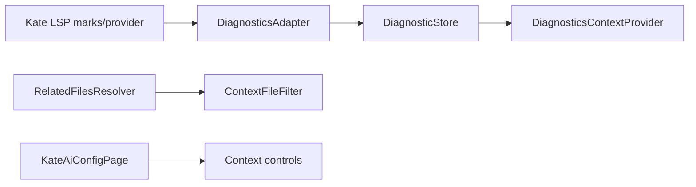

# Kate AI Phase 2H-2 Context Quality Hardening Design

## Background

Phase 2H-1 stabilized the shared context pipeline: path normalization, context item deduplication, prompt truncation, and Copilot prompt boundaries. The next hardening pass improves provider quality and UI clarity before Phase 3 strategy/cache work.



## Problem

1. `DiagnosticStore` has production ownership, but no adapter currently feeds it from Kate UI state.
2. Python relative imports treat all leading dots as current-directory imports, so `from ..core.foo import Bar` resolves too shallow.
3. Sensitive path filtering blocks useful source names such as `tokenizer.cpp` and `private_api.cpp`.
4. Qt JSON companion discovery includes every JSON file in the current directory, which can pull unrelated configuration into prompts.
5. Context settings controls remain enabled when the master contextual prompt switch or related-files switch is off, creating unclear UI state.

## Questions and Answers

### Q1: Can the diagnostics adapter use Kate LSP private headers?

Answer: Use public KTextEditor/Kate plugin-view APIs and Qt object introspection only. Kate LSP internals are private and version-sensitive. The adapter may locate the LSP plugin view and diagnostic provider dynamically, then use public document marks as a best-effort signal.

### Q2: What does “best effort” mean for diagnostics?

Answer: When Kate LSP diagnostic marks are visible on open documents, convert those lines into bounded `DiagnosticItem`s with source `Kate LSP` and message `Diagnostic reported by Kate LSP`. When the LSP plugin or marks are unavailable, keep the store empty and clear stale adapter-owned diagnostics.

### Q3: Should sensitive filtering keep broad token/private/password matching?

Answer: Move broad terms to user `ContextExcludePatterns`. Built-in filtering covers common secret files and directories: `.env*`, `secrets/`, `credentials/`, `.ssh/`, `*.pem`, `*.key`, `*.p12`, `*.pfx`, `id_rsa*`, and `id_ed25519*`.

### Q4: How strict should JSON related-file discovery be?

Answer: Always allow same-basename JSON companions. For other JSON files in the same directory, include only small text files containing plugin metadata markers such as `KPlugin`, `X-KDE`, `IID`, `MetaData`, `KPackage`, or `X-KDevelop`.

## Design

### DiagnosticsAdapter

Add:

```cpp
class DiagnosticsAdapter final : public QObject {
public:
    explicit DiagnosticsAdapter(QObject *parent = nullptr);
    void attach(KTextEditor::MainWindow *mainWindow, DiagnosticStore *store);

private:
    void rescanOpenDocuments();
    void rescanDocument(KTextEditor::Document *document);
};
```

Behavior:
- `PluginView` owns one adapter beside `DiagnosticStore`.
- `attach()` stores guarded pointers, connects `viewCreated`, `pluginViewCreated`, `pluginViewDeleted`, `marksChanged`, `documentUrlChanged`, `aboutToClose`, and a low-frequency single-shot rescan timer.
- The adapter treats LSP as available when `mainWindow->pluginView("lspclientplugin")` or `mainWindow->pluginView("lspclient")` exists, or when a child object named `LSPDiagnosticProvider` exists.
- If LSP availability is false, adapter clears diagnostics for open document URIs that it owns.
- If availability is true, the adapter scans each open document for `KTextEditor::Document::markType31`. Each marked line becomes one `DiagnosticItem` with line range `[line, line]`, severity `Warning`, source `Kate LSP`, code `markType31`, and message `Diagnostic reported by Kate LSP`.
- Adapter output is deterministic: items sorted by URI and line, duplicate lines collapsed.

This is intentionally conservative: it makes diagnostics context useful when Kate exposes LSP marks, while preserving safe empty-store behavior on installations without Kate LSP diagnostics.

### Python relative imports

Change `addPythonModule()` to preserve dot depth:

```cpp
int depth = countLeadingDots(module);
for (int i = 1; i < depth; ++i) {
    baseDir.cdUp();
}
QString rest = module.mid(depth).replace('.', '/');
```

Examples:
- `from .tools import run` resolves from the current package directory.
- `from ..core.foo import Bar` resolves from the parent package directory.
- `from ...shared import thing` walks up two directories.

### Sensitive path filter

Refine `ContextFileFilter::isPrivateLookingPath()`:
- exact and prefix files: `.env`, `.env.local`, `.env.production`
- secret directories: `secrets`, `credentials`, `.ssh`
- key material extensions: `pem`, `key`, `p12`, `pfx`
- key material files: `id_rsa`, `id_rsa.pub`, `id_ed25519`, `id_ed25519.pub`

Open-tabs and recent-edits local `isPrivateLookingPath()` helpers should either call the shared filter path rule or mirror the narrowed built-in rule.

### Qt JSON heuristic

Update `addQtCompanions()`:
- keep same-basename `<base>.json` at the current score
- scan other same-directory JSON files only when `ContextFileFilter::readTextFile()` succeeds and content contains a plugin metadata marker
- assign metadata JSON a low score, below direct source/header companions
- preserve deterministic `QDir::Name` order

### Settings UI enablement

Add `KateAiConfigPage::updateContextControlsUi()`:
- when `Enable contextual prompt` is off, disable context budget controls and all provider toggles/settings inside the Context group
- when contextual prompt is on and `Enable related files context` is off, disable related max file/char controls and context exclude patterns
- call from `loadUi()`, `slotUiChanged()`, and relevant checkbox toggles
- keep disabled values persisted when Apply is pressed

## Implementation Plan

1. Add tests for diagnostics adapter mark scanning and empty-store behavior when LSP is unavailable.
2. Add tests for Python `..` and `...` imports.
3. Add tests for sensitive false positives and built-in secret patterns.
4. Add tests for JSON metadata heuristic.
5. Add config page tests for disabled context controls and persistence of disabled values.
6. Implement `DiagnosticsAdapter` and wire it into `KateAiInlineCompletionPluginView`.
7. Implement Python dot-depth resolution.
8. Refine `ContextFileFilter` sensitive path rules and align open-tabs/recent-edits path checks.
9. Refine Qt JSON heuristic.
10. Implement context UI enablement.
11. Run targeted tests, full build, CTest, and code review.

## Examples

✅ `from ..core.foo import Bar` in `pkg/app/main.py` can include `pkg/core/foo.py`.

✅ `tokenizer.cpp`, `private_api.cpp`, and `password_validator_test.cpp` can enter context unless the user excludes them.

✅ `.env.local`, `config/prod.pem`, `secrets/api.txt`, and `.ssh/id_ed25519` stay out of prompts.

✅ `Foo.cpp` can include `Foo.json`; `other.json` enters context only when it looks like KDE/Qt plugin metadata.

✅ Turning off contextual prompts greys out context provider controls while preserving their saved values.

## Trade-offs

- DiagnosticsAdapter uses line-level LSP marks because public KTextEditor APIs do not expose full diagnostic messages. This gives useful locality without depending on Kate private headers.
- Sensitive filtering favors lower false positives by default and leaves project-specific broad rules to `ContextExcludePatterns`.
- JSON metadata scanning reads small text files during related-file resolution; existing per-file bounds and filters cap the cost.
- UI enablement is visual-only; persistence remains unchanged so users can prepare settings while controls are disabled.

## Implementation Results

- Added `DiagnosticsAdapter` and wired it into `KateAiInlineCompletionPluginView`; it detects Kate LSP plugin views/providers through public plugin-view APIs and scans public `markType31` document marks into `DiagnosticStore` as line diagnostics.
- Added connection tracking in `DiagnosticsAdapter` so reattach clears prior main-window/document/provider signal connections.
- Added Python relative import dot-depth support for `from ..core.foo import Bar` and deeper imports.
- Tightened built-in sensitive filtering to common secret files/directories/key material while allowing source names such as `tokenizer.cpp`, `private_api.cpp`, and `password_validator_test.cpp`.
- Kept `.envrc` blocked alongside `.env` and `.env.*`.
- Updated open-tabs and recent-edits filtering to use the shared `ContextFileFilter` while preserving safe unsaved document/display-name context.
- Refined Qt JSON related-file heuristic: same-basename JSON remains eligible; other JSON files need KDE/Qt plugin metadata markers.
- Added Context UI enablement logic so master context and related-files checkboxes disable dependent controls while preserving persisted values.
- Added tests: `DiagnosticsAdapterTest`, Python dot-depth resolver coverage, JSON metadata resolver coverage, sensitive-filter false-positive/privacy coverage, recent-edits unsaved display-name coverage, and config-page enablement coverage.
- Reviewer findings fixed: `.envrc` filtering, DiagnosticsAdapter stale connections, and unsaved open-tab/recent-edit filtering regression.
- Verification: `cmake --build build -j 8 && ctest --test-dir build --output-on-failure` passed 24/24.

### Deviations from original design

- DiagnosticsAdapter currently converts Kate LSP line marks into generic diagnostic messages. Full LSP diagnostic messages remain unavailable through stable public KTextEditor APIs.
- User `ContextExcludePatterns` still directly apply to related files; open-tabs and recent-edits use the shared built-in filter rules in this phase.
