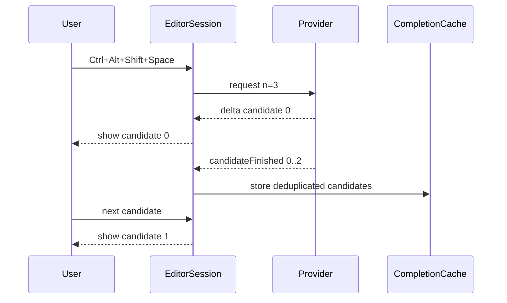
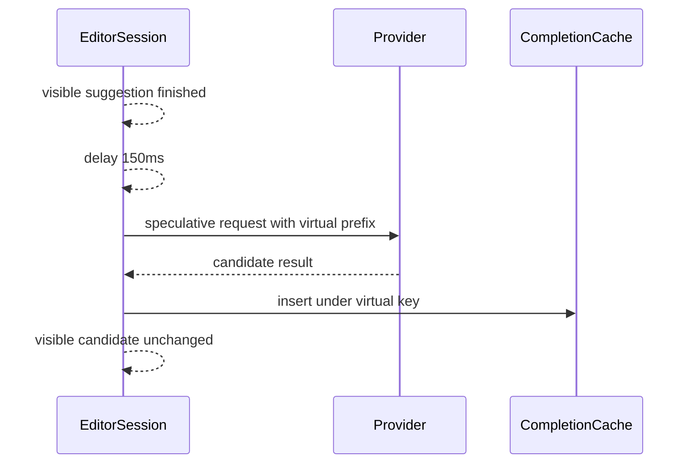

# Kate AI Inline Completion Phase 3C Candidate Cycling and Speculation Design

## Background

Phase 3A moved request-shape decisions into `CompletionStrategyEngine`. Phase 3B added `CompletionCache` and typing-as-suggested reuse so a visible completion can shrink while the user types through it. Phase 3C adds candidate awareness on top of that foundation.

Relevant files:

- `src/session/EditorSession.{h,cpp}` owns per-view suggestion state, request lifecycle, partial accept, typing-as-suggested, cache lookup, and cache insertion.
- `src/session/CompletionCache.{h,cpp}` stores one cached completion value per key.
- `src/network/AbstractAIProvider.h` already has `CompletionRequest::n`.
- `src/network/OpenAICompatibleProvider.cpp` streams only `choices[0]` today.
- `src/network/CopilotCodexProvider.cpp` sends `n` already, but also streams only `choices[0]` today.
- `src/plugin/KateAiInlineCompletionPluginView.{h,cpp}` owns per-main-window services and actions.
- `src/settings/CompletionSettings.{h,cpp}` and `src/settings/KateAiConfigPage.{h,cpp}` hold user-facing settings.

Research notes:

- OpenAI-compatible streamed chat completion chunks expose `choices[].index`, and a streamed response can contain multiple choices when `n > 1`.
- OpenAI-compatible streaming chunks should be accumulated by choice index, while the first candidate can continue to drive existing ghost text through `deltaReceived`.

## Problem

Current completion state stores a single visible suggestion. Manual trigger and cache reuse have no way to retain alternatives, so users cannot cycle among multiple useful completions returned for the same prompt state. Phase 3B cache also stores one value per key, so repeated requests can overwrite alternatives.

Phase 3C must add candidate lists while preserving the stable single-candidate automatic path.

## Questions and Answers

### Q1: Should automatic completion request multiple candidates?

Answer: Automatic completion requests one candidate. This preserves latency and current provider behavior. Manual trigger can request `manualCandidateCount` candidates.

### Q2: Should providers expose candidate-level results?

Answer: Add one signal to the provider interface:

```cpp
void candidateFinished(quint64 requestId, int index, QString fullText);
```

`deltaReceived` remains the streaming path for candidate 0. Providers accumulate full text by choice index and emit `candidateFinished` when a choice finishes or the stream completes.

### Q3: How should cache values evolve?

Answer: `CompletionCacheValue` stores a candidate vector as the canonical cache payload. Insertions normalize and deduplicate candidates, then cap by `maxStoredCandidates`.

### Q4: What speculative behavior fits this phase?

Answer: Implement a bounded optional speculative request with default disabled. After a valid visible suggestion is shown, `EditorSession` schedules one request using virtual prefix `prefix + currentCandidate.insertText`, caps tokens with `speculativeRequestMaxTokens`, stores valid results in cache only, and leaves the visible suggestion unchanged.

### Q5: How should typing-as-suggested interact with candidates?

Answer: The current candidate shrinks as Phase 3B already does. The candidate list keeps the remaining current candidate at the current index and drops alternatives that no longer match the typed prefix. This keeps the UI coherent and avoids showing alternatives for an earlier document state.

## Design

### CompletionCandidate

Create `src/session/CompletionCandidate.h`:

```cpp
struct CompletionCandidate {
    QString rawCompletion;
    QString insertText;
    QString displayText;
    KTextEditor::Range replaceRange = KTextEditor::Range::invalid();
    int suffixCoverage = 0;
    QString source;
    QString id;
};
```

`rawCompletion` is provider text after prompt sanitization context is still safe to reprocess. `insertText`, `displayText`, `replaceRange`, and `suffixCoverage` are current-cursor processed fields.

### CompletionCandidateList

Create `src/session/CompletionCandidateList.{h,cpp}` with:

```cpp
class CompletionCandidateList
{
public:
    void setCandidates(QVector<CompletionCandidate> candidates);
    void addCandidate(const CompletionCandidate &candidate);
    void clear();

    [[nodiscard]] bool isEmpty() const;
    [[nodiscard]] int size() const;
    [[nodiscard]] int currentIndex() const;
    [[nodiscard]] CompletionCandidate current() const;

    [[nodiscard]] bool next();
    [[nodiscard]] bool previous();

    [[nodiscard]] QVector<CompletionCandidate> candidates() const;

    static QVector<CompletionCandidate> deduplicated(QVector<CompletionCandidate> candidates);
};
```

Deduplication rules:

- Normalize CRLF/CR to LF.
- Trim leading/trailing whitespace for comparison.
- Collapse trailing whitespace on every line for comparison.
- Drop candidates with empty `insertText` or empty `displayText` after trimming.
- Preserve original order.
- Keep the first candidate for a normalized key.

### Provider Interface

Extend `AbstractAIProvider` with:

```cpp
void candidateFinished(quint64 requestId, int index, QString fullText);
```

Keep `deltaReceived` unchanged. Existing tests and UI continue to depend on first-candidate streaming.

### OpenAI-Compatible Provider

Request payload:

```cpp
if (request.n > 1) {
    payload["n"] = request.n;
}
```

Streaming parse:

- Iterate every object in `choices`.
- Read `index` with default `0`.
- Append `delta.content` to an accumulator for that index.
- Emit `deltaReceived(requestId, content)` for index `0` only.
- Emit `candidateFinished(requestId, index, fullText)` when `finish_reason` is set for that index.
- Treat `[DONE]` as request completion and emit any accumulated candidates that were not already emitted.

This keeps first-candidate latency unchanged and adds full alternatives after enough chunks arrive.

### Copilot Provider

Copilot already sends `n`. Add the same accumulator pattern using `choices[].index` and `choices[].text`. Keep `deltaReceived` for index `0` only. Auth/session endpoint behavior remains unchanged.

### CompletionCache Candidate Lists

Update `CompletionCacheValue`:

```cpp
QVector<CompletionCandidate> candidates;
```

`insert()` transforms incoming value:

1. Read candidates from `value.candidates`.
2. Deduplicate with `CompletionCandidateList::deduplicated`.
3. Cap to `options.maxStoredCandidates`.
4. Skip insertion when the normalized candidate list is empty.

`lookupExact()` returns the candidate list. `lookupTypingAsSuggested()` returns a value with all candidates whose processed text starts with the typed prefix, shrunk by that prefix and deduplicated again.

`CompletionCacheOptions` gains:

```cpp
int maxStoredCandidates = 8;
```

### EditorSession Candidate State

Add fields:

```cpp
CompletionCandidateList m_candidates;
QHash<int, QString> m_activeCandidateRawByIndex;
QSet<int> m_emittedCandidateIndexes;
QTimer m_speculativeTimer;
quint64 m_speculativeRequestId = 0;
CompletionCacheKey m_speculativeCacheKey;
bool m_speculativeRequestActive = false;
```

The current candidate drives `GhostTextState`.

Helper methods:

```cpp
void setCandidatesForCurrentAnchor(QVector<CompletionCandidate> candidates);
bool applyCurrentCandidate();
CompletionCandidate candidateFromProcessed(QString raw, const ProcessedSuggestion &processed, QString source) const;
void maybeInsertCandidatesIntoCache();
void scheduleSpeculativeRequestIfEnabled(const CompletionSettings &settings);
void startSpeculativeRequest();
void cancelSpeculativeRequest();
```

### Request Flow

`startRequest()` flow:

1. Build strategy, context items, provider request, and hash-only cache fingerprints.
2. Set `request.n = manualCandidateCount` when `manualTrigger && enableCandidateCycling`.
3. Set `request.n = 1` for automatic requests.
4. Build a cache key from prefix/suffix, provider identity, context/request fingerprints, strategy, and requested candidate count.
5. Try cache lookup.
6. On cache hit, reprocess raw candidates for current cursor, populate `CompletionCandidateList`, apply current candidate, skip provider start.
7. On miss, start provider.

`onDeltaReceived()` continues to process candidate 0 streaming and updates candidate list slot 0.

`onCandidateFinished()`/the provider finished-candidate slot processes a full candidate by index, appends/replaces in the candidate list, deduplicates, and leaves current index stable when possible.

`onRequestFinished()` inserts all valid candidates into cache and schedules speculation when enabled.

### Cycling Actions

Add actions:

- `kate_ai_inline_completion_next_candidate`
- `kate_ai_inline_completion_previous_candidate`

Default shortcuts:

- Next: `Ctrl+Alt+Shift+Down`
- Previous: `Ctrl+Alt+Shift+Up`

`EditorSession` public methods:

```cpp
void nextCandidate();
void previousCandidate();
[[nodiscard]] int candidateCount() const;
```

Action state is enabled when the active session has visible suggestion and `candidateCount() > 1`.

Cycling behavior:

- Calls `m_candidates.next()` or `previous()`.
- Applies the current candidate to `GhostTextState`.
- Preserves anchor through `syncAnchorFromTracker()`.
- Skips cycling if replace range is unsafe for the current cursor.

If cycling is requested with one candidate and candidate cycling is enabled, call `triggerSuggestion()` with manual mode to request more candidates.

### Partial Accept and Typing-as-Suggested

Full accept uses the current candidate.

Partial accept updates current candidate with the remaining processed text. Alternatives are filtered to those that start with the accepted chunk, then shrunk by that chunk. If no alternatives remain, only the current candidate remains.

Typing-as-suggested uses the same shrink/filter helper. Active streaming requests continue as Phase 3B requires.

### Speculative Request

Default setting is disabled.

When enabled:

- Schedule after `speculativeRequestDelayMs` after a valid non-speculative visible suggestion is shown and request has finished.
- Build virtual prompt context with `prefix + currentCandidate.insertText` and the same suffix.
- Use strategy mode derived from virtual cursor but cap `maxTokens = speculativeRequestMaxTokens`.
- Start provider with `n = 1`.
- Store valid result in cache under the virtual cache key.
- Keep current visible suggestion unchanged.

Cancellation:

- `bumpGeneration()` cancels speculative timer/request.
- Provider/settings changes clear cache through PluginView and normal request cancellation.
- Cursor movement/document edits cancel speculation through generation bump.
- Speculative result never schedules another speculative request.

### Settings

Add to `CompletionSettings`:

```cpp
bool enableCandidateCycling = true;
int manualCandidateCount = 3;
int maxStoredCandidates = 8;
bool enableSpeculativeRequests = false;
int speculativeRequestDelayMs = 150;
int speculativeRequestMaxTokens = 64;
```

Bounds:

- `manualCandidateCount`: 1..10
- `maxStoredCandidates`: 1..20
- `speculativeRequestDelayMs`: 0..5000
- `speculativeRequestMaxTokens`: 8..512

Add a compact `Candidates` group in settings UI.

## Implementation Plan

### Phase 1: Candidate Model

1. Add `CompletionCandidate.h`.
2. Add `CompletionCandidateList.{h,cpp}`.
3. Add `CompletionCandidateListTest` with empty behavior, set reset, wrap next/previous, dedup, and invalid dropping.

### Phase 2: Cache Candidate Lists

1. Include `CompletionCandidate.h` in `CompletionCache`.
2. Add `QVector<CompletionCandidate> candidates` to `CompletionCacheValue`.
3. Add `CompletionCacheOptions::maxStoredCandidates`.
4. Update insertion, exact lookup, and typing-as-suggested lookup.
5. Extend `CompletionCacheTest` for multi-candidate storage, max stored cap, dedup, and typing shrink.

### Phase 3: Provider Multi-Candidate Signal

1. Add `candidateFinished` signal to `AbstractAIProvider`.
2. Add `n` payload support to OpenAI-compatible provider.
3. Accumulate OpenAI-compatible choices by index.
4. Accumulate Copilot choices by index.
5. Keep candidate 0 streaming via `deltaReceived`.
6. Add or update provider tests if existing fake-server integration coverage reaches request payload and candidate flow.

### Phase 4: EditorSession Candidate Integration

1. Add `CompletionCandidateList` member and candidate helpers.
2. Replace single cache value use with candidate list use.
3. Update network delta and candidate signal handlers.
4. Update cache insertion to store all candidates.
5. Update typing-as-suggested and partial accept to shrink/filter candidate list.
6. Add integration tests for next/previous, accept after cycling, and manual multi-candidate request.

### Phase 5: Actions and UI

1. Add next/previous actions and default shortcuts in PluginView.
2. Add action-state logic for `candidateCount() > 1`.
3. Add settings bounds/load/save/defaults.
4. Add `Candidates` UI controls and tests.

### Phase 6: Speculation

1. Add disabled-by-default speculation settings.
2. Add speculative timer/request state.
3. Implement virtual prompt cache-only request path.
4. Add deterministic integration test proving speculative result enters cache and visible suggestion stays unchanged.

### Phase 7: Verification

Run:

```bash
git diff --check
cmake --build build -j 8
ctest --test-dir build --output-on-failure
```

Request code review and fix findings.

## Examples

### Manual multi-candidate



### Speculative cache-only result



## Trade-offs

- Provider signal extension gives real multi-candidate cycling for OpenAI-compatible and Copilot while preserving first-candidate streaming behavior.
- Candidate list in `EditorSession` avoids replacing render state; `GhostTextState` remains the rendered projection.
- Speculation stays disabled by default because it can spend tokens and network capacity.
- Context fingerprinting remains a future hardening item because Phase 3B cache keys already cover the core prompt state and provider identity.

## Deferred Work

- NES and inline edits remain Phase 4.
- Rich cycling UI and candidate preview menu remain future work.
- Cross-main-window candidate cache remains future work.
- Provider-specific advanced sampling controls beyond `n` remain future work.

## Implementation Results

Implemented Phase 3C in the working copy.

Files added:

- `src/session/CompletionCandidate.h`
- `src/session/CompletionCandidateList.{h,cpp}`
- `autotests/CompletionCandidateListTest.cpp`

Main implementation points:

- Added `CompletionCandidateList` for deduplicated candidate storage and wraparound cycling.
- Reworked `CompletionCacheValue` as a candidate-list payload with `CompletionCacheOptions::maxStoredCandidates`.
- Added provider signal `candidateFinished(quint64 requestId, int index, QString fullText)`.
- Updated OpenAI-compatible and Copilot providers to accumulate streamed choices by `choices[].index` while keeping candidate 0 on `deltaReceived`.
- Added provider bounds for candidate index count and accumulated candidate text, with deterministic sorted pending emission.
- Added `EditorSession::nextCandidate()`, `previousCandidate()`, and `candidateCount()`.
- Added next/previous candidate actions:
  - `kate_ai_inline_completion_next_candidate`
  - `kate_ai_inline_completion_previous_candidate`
- Added settings/UI for candidate cycling, manual candidate count, stored candidate cap, and optional speculative requests.
- Implemented cache-only speculative request flow with a timer, separate request id, and virtual prefix key.
- Hardened cache keys with assembled prompt hash, request shape hash, and requested candidate count.
- Added a stable `untitled:<uuid>` document identity for unsaved documents so cache keys stay stable across first-line edits.
- Added `candidateStateChanged()` so UI action state refreshes as candidates arrive.
- Skipped network cache insertion after typing-as-suggested or partial accept during active streaming to avoid caching truncated completions under the original key.
- Fixed Copilot cancel-before-network cleanup for pending auth acquisitions.

Review follow-up fixes:

- Manual candidate requests use a distinct cache key from automatic single-candidate requests.
- QAction state refreshes when candidate count changes.
- Cache keys include prompt/request fingerprints using hashes only; full prompts stay out of cache values.
- Streaming reuse no longer stores shortened remainders under the original request key.
- Provider candidate accumulation is bounded and emitted in deterministic order.

Tests added/extended:

- `CompletionCandidateListTest`: empty behavior, reset, wraparound, dedup, invalid drop.
- `CompletionCacheTest`: multi-candidate storage, cap, dedup, typing shrink, prompt fingerprint, candidate-count identity.
- `EditorSessionIntegrationTest`: manual multi-candidate request/cycling, accept after cycling, partial accept after cycling, manual request after single-candidate cache, speculative cache-only result, streaming typing cache skip.
- `CompletionSettingsTest` and `KateAiConfigPageTest`: candidate/speculative settings validation and UI mapping.

Verification:

```bash
git diff --check && cmake --build build -j 8 && ctest --test-dir build --output-on-failure
```

Result: `27/27` tests passed.
