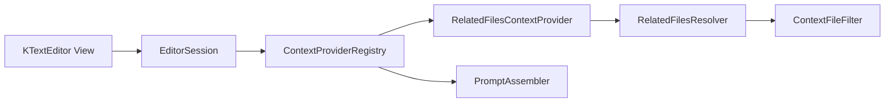

# Kate AI Related Files Context Provider and Settings UI Design

- Date: 2026-05-16
- Status: Design
- Scope: Phase 2C only: related-file context and compact context settings UI.

## Background
Phase 1 added bounded context providers and prompt assembly. Phase 2A added recent edits. Phase 2B added diagnostics. The next useful source is cheap repository-local files: headers, build files, local imports, sibling modules, UI resources, and component companions.

Qt/KTextEditor provides document text and URLs for open views. QFileInfo/QDir/QFile provide enough deterministic file discovery and bounded text reads. QFileInfo suffix and path APIs cover extension-based heuristics without extra dependencies.

## Problem
Current contextual prompts miss nearby files that define declarations, imports, build metadata, and component resources. Users also need visible controls for contextual prompt features now that several providers exist.

## Questions and Answers
### Q1. How expensive can discovery be?
A1. Discovery stays local and bounded. It checks same-directory companions, nearby build files, simple import/module declarations in the current file, and open documents first.

### Q2. How is privacy handled?
A2. `ContextFileFilter` applies default excluded directories, generated-file names, binary-looking extensions/content, max file size, and user exclude patterns before reading snippets.

### Q3. How should related files render?
A3. `RelatedFilesContextProvider` emits `CodeSnippet` items with provider id `related-files`. `PromptAssembler` renders them as `Compare this related file from <path>:`.

### Q4. How should settings UI work?
A4. Add a compact `Context` group to `KateAiConfigPage` with toggles and spin boxes for context providers and related-file budgets. Keep recent/diagnostic advanced options persistence-only.

## Design
### ContextFileFilter
Files:
- `src/context/ContextFileFilter.h`
- `src/context/ContextFileFilter.cpp`

Responsibilities:
- Reject excluded directories: `.git`, `build`, `cmake-build-*`, `node_modules`, `dist`, `target`, `.venv`, `venv`, `site-packages`, `__pycache__`.
- Reject generated names: `.min.js`, `moc_*.cpp`, `ui_*.h`, `qrc_*.cpp`.
- Reject private names such as `.env`, `secret`, `token`, `credential`, `password`, `private`.
- Reject large files and binary-looking content/extensions.
- Apply semicolon/list exclude patterns deterministically.

### RelatedFilesResolver
Files:
- `src/context/RelatedFilesResolver.h`
- `src/context/RelatedFilesResolver.cpp`

Responsibilities:
- Build ordered candidate paths for C/C++/Qt/KDE, Python, JS/TS, Rust, and generic same-basename companions.
- Prefer open documents by accepting a map of `path -> text` and marking candidates from open docs.
- Read active document text from the caller for import parsing.
- Resolve relative paths under the current file directory and project root.

### RelatedFilesContextProvider
Files:
- `src/context/RelatedFilesContextProvider.h`
- `src/context/RelatedFilesContextProvider.cpp`

Responsibilities:
- Provider id: `related-files`.
- Importance: `80`.
- Resolve candidates, filter/read snippets, enforce max files and character budgets, emit `CodeSnippet` items with relative names.

### Settings and UI
Add settings:
- `EnableOpenTabsContext = true`
- `EnableRelatedFilesContext = true`
- `RelatedFilesMaxFiles = 6`
- `RelatedFilesMaxChars = 12000`
- `RelatedFilesMaxCharsPerFile = 4000`
- `RelatedFilesPreferOpenTabs = true`
- `ContextExcludePatterns = QStringList{}`

Add `KateAiConfigPage` Context group controls:
- Enable contextual prompt
- Max context items
- Max context characters
- Enable open tabs context
- Enable recent edits context
- Enable diagnostics context
- Enable related files context
- Max related files
- Max related file characters
- Max characters per related file
- Context exclude patterns

### Integration
`EditorSession` adds `RelatedFilesContextProvider` before `OpenTabsContextProvider` when enabled. `OpenTabsContextProvider` respects `EnableOpenTabsContext`.

## Implementation Plan
1. Add tests for filtering, resolver heuristics, provider snippets, prompt rendering, settings persistence, and config UI.
2. Implement filter and resolver.
3. Implement provider and prompt rendering.
4. Add settings fields, validation, load/save, and UI controls.
5. Wire provider into `EditorSession` and CMake.
6. Run full build and CTest.

## Examples
✅ C++ source `src/foo.cpp` can include `src/foo.h`, `src/CMakeLists.txt`, `src/foo.ui`, and small plugin JSON files.

✅ TypeScript `src/Button.tsx` can include `src/Button.css`, `src/Button.test.tsx`, and `./theme.ts` imported from the active file.

❌ Files under `node_modules`, `build`, `.git`, and generated `moc_*.cpp` are excluded.

## Trade-offs
- The resolver uses deterministic heuristics instead of repository-wide search indexes.
- Import parsing is intentionally simple and line-based.
- Settings UI exposes provider toggles and budgets while keeping diagnostic/recent advanced knobs in persistence for now.

## Implementation Results
- Added `ContextFileFilter` with default excluded directories, generated-file filters, private-looking path filters, binary extension/content checks, max-size checks, and user exclude patterns.
- Added `RelatedFilesResolver` with C/C++/Qt/KDE, Python, JavaScript/TypeScript, Rust, and generic same-basename heuristics.
- Added `RelatedFilesContextProvider` with provider id `related-files`, bounded snippet reads, open-document preference, project-root confinement, and relative path names.
- Updated `PromptAssembler` to render related-file snippets as `Compare this related file from <path>:`.
- Added contextual settings fields for open-tabs and related-files context, plus `ContextExcludePatterns` persistence.
- Added a compact `Context` group to `KateAiConfigPage` with contextual prompt toggles, budgets, related-file limits, and exclude pattern controls.
- Added tests: `ContextFileFilterTest`, `RelatedFilesResolverTest`, `RelatedFilesContextProviderTest`, prompt rendering coverage, settings persistence coverage, and config UI coverage.
- Reviewer findings addressed during implementation: project-root confinement blocks `../` and remote URI escapes; symlink targets are checked through canonical paths; resolver scores propagate into `ContextItem::importance`; open document text is bounded before being copied into context.
- Verification: `cmake --build build -j 8 && ctest --test-dir build --output-on-failure` => 22/22 passed.

### Deviations from original design
- Related-file discovery stays synchronous and heuristic-only. Repository indexing and full import graph traversal remain future work.
- The UI exposes core context toggles and related-file budgets; advanced recent-edits and diagnostics knobs remain persistence-only.
