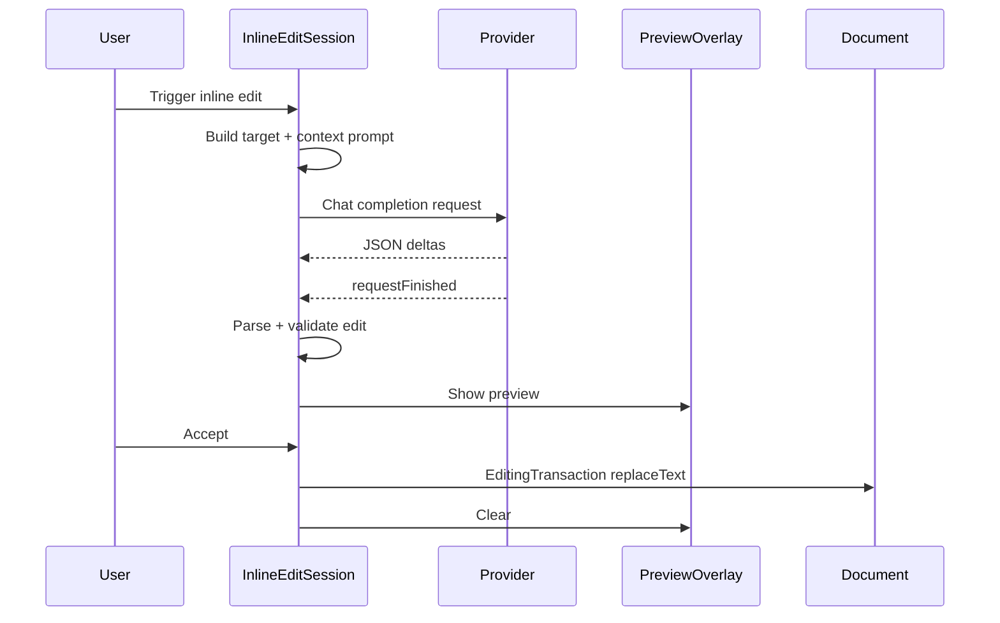

# Kate AI Inline Completion Phase 4A Inline Edit Core Design

## Background

Phase 1-3 provide completion prompts, context providers, post-processing, request strategy, local completion cache, typing-as-suggested reuse, and candidate cycling. Phase 4A adds the first inline edit path: a user manually asks for one range replacement, sees a preview, then accepts or dismisses it.

Relevant files:

- `src/network/AbstractAIProvider.h`, `OpenAICompatibleProvider`, `CopilotCodexProvider`: existing streaming provider abstraction.
- `src/context/*`: existing bounded synchronous context engine.
- `src/plugin/KateAiInlineCompletionPluginView.{h,cpp}`: owns per-window services/actions and per-view sessions.
- `src/session/EditorSession.{h,cpp}`: owns ghost completion lifecycle.
- `src/render/GhostTextOverlayWidget.*`: simple editor-widget overlay pattern to reuse for preview style.
- `src/settings/CompletionSettings.{h,cpp}` and `src/settings/KateAiConfigPage.{h,cpp}`: settings persistence and UI.

Research notes:

- KTextEditor supports dynamic attributes/ranges for range highlighting. A minimal QWidget overlay is also consistent with the current ghost rendering path.
- Structured inline edit responses should keep model output constrained to line/column JSON with 1-based positions and explicit replacement text.

## Problem

The plugin currently inserts completion text only at the cursor. It has no workflow for asking the model to rewrite an existing selection or line, previewing the replacement, and applying it transactionally. Phase 4A must add this without altering existing ghost-text completion behavior, candidate cache behavior, or Copilot OAuth flow.

## Questions and Answers

### Q1: What triggers inline edits in Phase 4A?

Answer: Manual action only: `kate_ai_inline_edit_trigger`. Automatic NES, diagnostic-triggered fixes, and recent-edit suggestions are Phase 4B/4C.

### Q2: What range is edited?

Answer: Selection first. When there is no selection, use the current line as the target range. This gives deterministic behavior and avoids heuristic block parsing in Phase 4A.

### Q3: Which provider path is enabled?

Answer: OpenAI-compatible and Ollama chat completions use the existing provider path. GitHub Copilot Codex is disabled for inline edits unless `inlineEditCopilotExperimental` is enabled. The experimental path still uses existing provider/auth objects and never changes Copilot endpoints or headers.

### Q4: How is the preview rendered?

Answer: A minimal `InlineEditPreviewOverlay` attached to the editor widget. It shows the replacement text near the target start and highlights the target range area enough for Phase 4A. The document buffer stays unchanged until accept.

### Q5: How are edits validated?

Answer: `InlineEditParser` accepts plain or fenced JSON, converts 1-based positions to `KTextEditor::Range`, accepts the first valid edit only, rejects invalid/out-of-bounds/no-op edits, caps `newText`, normalizes CRLF/CR to LF, and preserves all other whitespace.

## Design

### Data Models

Add `src/inlineedit/InlineEdit.h`:

```cpp
struct ProposedEdit {
    KTextEditor::Range range;
    QString newText;
};

struct InlineEditSuggestion {
    QVector<ProposedEdit> edits;
    QString rawResponse;
    QString displayText;
    QString source;
    bool valid = false;
};

struct InlineEditRequestContext {
    QString filePath;
    QString languageId;
    KTextEditor::Cursor cursor;
    KTextEditor::Range targetRange;
    QString selectedText;
    QString prefixExcerpt;
    QString suffixExcerpt;
    QVector<ContextItem> contextItems;
};
```

Phase 4A requires exactly one edit in accepted suggestions. The vector shape is kept for Phase 4C.

### InlineEditParser

Files:

- `src/inlineedit/InlineEditParser.h`
- `src/inlineedit/InlineEditParser.cpp`

API:

```cpp
struct InlineEditParserOptions {
    int maxNewTextChars = 8000;
    bool allowDeletion = false;
};

class InlineEditParser {
public:
    static InlineEditSuggestion parse(const QString &response,
                                      KTextEditor::Document *document,
                                      const InlineEditParserOptions &options = {});
};
```

Rules:

- Strip a single fenced block such as ```json ... ``` when present.
- Parse JSON object with `edits` array.
- Iterate edits and accept the first valid edit.
- JSON coordinates are 1-based; internal ranges are 0-based.
- Reject missing edits, invalid JSON, invalid ranges, document-out-of-bounds ranges, `newText` above max, and no-op replacements.
- Reject empty `newText` in Phase 4A because deletion stays deferred.
- Normalize CRLF/CR to LF.

### InlineEditPromptBuilder

Files:

- `src/inlineedit/InlineEditPromptBuilder.h`
- `src/inlineedit/InlineEditPromptBuilder.cpp`

API:

```cpp
struct InlineEditPrompt {
    QString systemPrompt;
    QString userPrompt;
};

struct InlineEditPromptOptions {
    bool useContext = true;
    int maxContextChars = 6000;
};

class InlineEditPromptBuilder {
public:
    static InlineEditPrompt build(const InlineEditRequestContext &context,
                                  const InlineEditPromptOptions &options = {});
};
```

Prompt content:

- JSON-only instruction.
- File path, language, cursor line/column.
- Target range with 1-based positions.
- Current target text.
- Nearby prefix and suffix excerpts.
- Existing context items rendered as deterministic compact sections when enabled.
- Strict return schema.

### InlineEditPreviewOverlay

Files:

- `src/render/InlineEditPreviewOverlay.h`
- `src/render/InlineEditPreviewOverlay.cpp`

Behavior:

- Attach to `view->editorWidget()` like `GhostTextOverlayWidget`.
- `setSuggestion(InlineEditSuggestion)` stores one preview.
- `clear()` hides the overlay.
- Render the replacement text at the first edit range start using muted AI color. Multiline replacements draw line-by-line and cap display lines to keep UI bounded.

### InlineEditSession

Files:

- `src/inlineedit/InlineEditSession.h`
- `src/inlineedit/InlineEditSession.cpp`

Responsibilities:

- Manual trigger target selection/current-line.
- Collect prefix/suffix excerpts and existing bounded context items.
- Start provider request with chat-style prompts.
- Accumulate `deltaReceived` for the active inline edit request.
- Parse on `requestFinished`.
- Show preview on valid single edit.
- Accept edit transactionally, applying edits bottom-to-top for future multi-edit compatibility.
- Dismiss clears preview and cancels active request.
- Clear preview/request on cursor move, document change, focus out, view destruction, or settings/provider change.

Provider behavior:

- OpenAI-compatible/Ollama: use existing `OpenAICompatibleProvider` through `AbstractAIProvider`.
- Copilot: disabled unless `inlineEditCopilotExperimental` is enabled. Existing auth/session manager is reused when experimental.
- No prompts, tokens, auth headers, or full request headers are stored.

### PluginView Integration

Add one `InlineEditSession` per `KTextEditor::View`, parallel to `EditorSession`:

- Create it in `ensureSession()` with the same services.
- Connect `previewStateChanged` to action state updates.
- Add actions:
  - `kate_ai_inline_edit_trigger`: `Ctrl+Alt+Shift+E`
  - `kate_ai_inline_edit_accept`: `Ctrl+Alt+Shift+Enter`
  - `kate_ai_inline_edit_dismiss`
- Existing dismiss action first dismisses inline edit if active, then ghost text.

### Settings

Add to `CompletionSettings`:

```cpp
bool enableInlineEdits = true;
int inlineEditMaxNewTextChars = 8000;
int inlineEditMaxPrefixChars = 6000;
int inlineEditMaxSuffixChars = 3000;
bool inlineEditUseContext = true;
bool inlineEditCopilotExperimental = false;
```

Bounds:

- `inlineEditMaxNewTextChars`: 100..50000
- `inlineEditMaxPrefixChars`: 0..20000
- `inlineEditMaxSuffixChars`: 0..20000

Add compact `Inline Edits` UI controls.

## Implementation Plan

1. Add parser/prompt tests and verify RED.
2. Implement `src/inlineedit` models, parser, and prompt builder.
3. Add session/preview integration tests and verify RED.
4. Implement `InlineEditPreviewOverlay` and `InlineEditSession`.
5. Wire actions/settings/UI and CMake.
6. Run targeted tests, full build, and full CTest.
7. Request code review, fix findings, update this design log with results, and write Serena memory.

## Examples

### Manual selected-range edit



## Trade-offs

- Current-line fallback keeps Phase 4A deterministic. Syntactic block targeting moves to Phase 4B.
- Minimal overlay gives immediate preview without a full diff renderer. Rich inline diff stays Phase 4C.
- Reusing `AbstractAIProvider` keeps auth and endpoint behavior centralized.
- Copilot inline edit stays gated because Codex completion is not a reliable structured-output chat endpoint.

## Deferred Work

- Automatic NES triggers.
- Multi-range edits and conflict resolution.
- Diagnostics-triggered quick fixes.
- Advanced diff rendering with per-line additions/deletions.
- Copilot inline edit default support after a reliable structured-output endpoint exists.

## Implementation Results

Implemented Phase 4A as a manual single-range inline edit workflow.

Files added:

- `src/inlineedit/InlineEdit.h`
- `src/inlineedit/InlineEditParser.{h,cpp}`
- `src/inlineedit/InlineEditPromptBuilder.{h,cpp}`
- `src/inlineedit/InlineEditSession.{h,cpp}`
- `src/render/InlineEditPreviewOverlay.{h,cpp}`
- `autotests/InlineEditParserTest.cpp`
- `autotests/InlineEditPromptBuilderTest.cpp`
- `autotests/InlineEditSessionTest.cpp`

Files updated:

- `src/plugin/KateAiInlineCompletionPluginView.{h,cpp}`
- `src/settings/CompletionSettings.{h,cpp}`
- `src/settings/KateAiConfigPage.{h,cpp}`
- `src/CMakeLists.txt`
- `autotests/CMakeLists.txt`
- `autotests/CompletionSettingsTest.cpp`
- `autotests/KateAiConfigPageTest.cpp`

Behavior delivered:

- Manual inline edit trigger targets the selection or current line.
- Existing completion provider path is reused for OpenAI-compatible/Ollama requests.
- Copilot inline edits are gated by `inlineEditCopilotExperimental`.
- Streaming deltas are accumulated, parsed as JSON, validated, then rendered by a lightweight preview overlay.
- Accept applies the replacement inside `KTextEditor::Document::EditingTransaction`.
- Dismiss cancels active requests and clears previews.
- Cursor movement, document changes, selection changes, focus loss, view destruction, and provider/settings changes clear stale inline edit state.
- Existing ghost text dismiss behavior now clears inline edits first, then ghost text.
- Settings are validated, persisted, and exposed in the config page.

Review follow-up fixes:

- Parser now rejects multi-edit responses for Phase 4A.
- Parser/session validate the provider edit range against the user-requested target range.
- Selection changes cancel active inline edit requests as well as previews.
- Overlay teardown explicitly clears/deletes the preview widget and removes its event filter.
- Overlay refreshes on view scroll, display-range, and config changes.
- Prompt/error URL rendering removes URL user-info.
- Copilot inline edit requests do not receive the OpenAI-compatible API key field.
- Cancelled requests clear the active request id before provider cancellation callbacks can arrive.

Verification:

- `cmake --build build -j 8` passed.
- `ctest --test-dir build --output-on-failure` passed: 30/30.
- `git diff --check` passed.

Deviation from design:

- Preview rendering uses a single bounded overlay label with target-range highlighting via KTextEditor attributes, matching Phase 4A scope while keeping the document buffer unchanged before accept.
