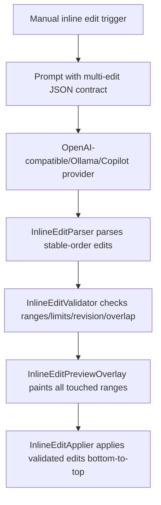

# Kate AI Phase 4B Multi-Range Inline Edits Design

## Background
Phase 4A supports manual inline edits for exactly one range: the user triggers an inline edit, the provider returns structured JSON with one edit, Kate shows a non-mutating preview, and accepting applies the edit in one document transaction.

Phase 4B upgrades the manual path to support several independent edits in one suggestion. Automatic diagnostics-triggered NES and recent-edit-triggered NES stay in Phase 4C.

## Problem
A model can naturally return separate changes, such as renaming one local use and updating a nearby return statement. Applying these as one large range loses locality and can obscure review. Applying several independent ranges requires deterministic validation and bottom-to-top application so all ranges refer to the original document state.

## Questions and Answers
- Q: Are multi-edit suggestions automatic?
  - A: Manual trigger only in Phase 4B.
- Q: Can several insertions target the exact same cursor?
  - A: They are rejected in Phase 4B because ordering semantics are ambiguous.
- Q: Can deletion be returned?
  - A: Yes, when `inlineEditAllowDeletion` is enabled. Default is enabled.
- Q: Can edits target ranges outside the original selected/current-line target?
  - A: Returned edit ranges must stay within the requested target range. Users can select a wider range when they want a wider manual edit scope.
- Q: Does document content change during preview?
  - A: No. Preview remains overlay-only until accept.

## Design

### Data Flow


### Parser
`InlineEditParser` accepts any positive number of edit objects up to `InlineEditParserOptions::maxEdits`. Each edit is parsed independently from 1-based line/column JSON into a 0-based `KTextEditor::Range`. `newText` must be a JSON string and CRLF/CR are normalized to LF. Parser rejects malformed objects, out-of-bounds ranges, disabled deletions, no-op empty insertions, per-edit char limit breaches, total char limit breaches, and exact same-text replacements.

### Validator
New `InlineEditValidator` validates an already parsed `InlineEditSuggestion` against the current document and settings. It returns a value object with `ok`, normalized edits, and a user-safe reason. It checks:
- non-empty valid edit list,
- edit count within limit,
- per-edit and total new text size,
- document revision equals the request revision when provided,
- every range fits current document bounds,
- no duplicate ranges,
- no overlapping ranges after sorting by start,
- adjacent ranges are accepted,
- duplicate same-position insertions are rejected.

### Applier
New `InlineEditApplier` applies a validated edit set in one `KTextEditor::Document::EditingTransaction`. It prevalidates before mutating, sorts by range start descending, then calls `replaceText(range, newText)` for each edit. Tests cover deterministic valid cases and invalid prevalidation that leaves the document unchanged.

### Preview
`InlineEditPreviewOverlay` keeps the existing overlay approach and iterates over every edit. For each edit it highlights the touched line band and draws a short preview text near the edit start. Insertions show inserted ghost text, replacements show replacement text, deletions show a delete marker. Preview truncates each edit to `inlineEditPreviewMaxLines` lines with an ellipsis.

### Settings
Add:
- `inlineEditMaxEdits`, default `4`, bounds `1..20`.
- `inlineEditMaxTotalNewTextChars`, default `16000`, bounds `100..100000`.
- `inlineEditAllowDeletion`, default `true`.
- `inlineEditPreviewMaxLines`, default `8`, bounds `1..50`.

### Prompt Contract
The prompt asks for JSON only and permits multiple edits:
```json
{
  "edits": [
    {
      "startLine": 12,
      "startColumn": 5,
      "endLine": 13,
      "endColumn": 1,
      "newText": "replacement text"
    }
  ],
  "rationale": "short explanation"
}
```
It instructs the model to return the smallest set of edits, use multiple edits only for naturally separate locations, and prefer one edit for local changes.

## Implementation Plan
1. Add parser options for edit count, total chars, deletion, and preview display limits; update parser tests first.
2. Add `InlineEditValidator` and tests for overlap, adjacency, duplicates, bounds, stale revision, and limits.
3. Add `InlineEditApplier` and tests for bottom-to-top transaction application.
4. Update `InlineEditSession` to record request revision, parse multi-edit suggestions, validate before preview/apply, and use applier on accept.
5. Update overlay to render all edits with per-edit preview lines.
6. Add settings defaults, validation, load/save, UI controls, and tests.
7. Update prompt builder contract and tests.
8. Run review and local verification. Push after local success. GitHub Actions may run asynchronously for this task.

## Examples

✅ Non-overlapping edits:
```json
{"edits":[
  {"startLine":2,"startColumn":5,"endLine":2,"endColumn":13,"newText":"newName"},
  {"startLine":5,"startColumn":1,"endLine":5,"endColumn":1,"newText":"const int count = 0;\n"}
]}
```

✅ Adjacent edits:
```json
{"edits":[
  {"startLine":1,"startColumn":1,"endLine":1,"endColumn":3,"newText":"aa"},
  {"startLine":1,"startColumn":3,"endLine":1,"endColumn":5,"newText":"bb"}
]}
```

❌ Overlap:
```json
{"edits":[
  {"startLine":1,"startColumn":1,"endLine":1,"endColumn":5,"newText":"one"},
  {"startLine":1,"startColumn":4,"endLine":1,"endColumn":8,"newText":"two"}
]}
```

❌ Duplicate insertion cursor:
```json
{"edits":[
  {"startLine":3,"startColumn":1,"endLine":3,"endColumn":1,"newText":"a"},
  {"startLine":3,"startColumn":1,"endLine":3,"endColumn":1,"newText":"b"}
]}
```

## Trade-offs
- The overlay stays lightweight and line-based. It gives clear enough review feedback without changing the buffer or adding heavy diff widgets.
- We reject ambiguous same-position insertions rather than merging. That keeps Phase 4B deterministic.
- We validate again before accept because the document may change after preview.
- Partial rollback is not assumed. The applier prevalidates aggressively and tests focus on safe deterministic cases.

## Implementation Results
Implemented Phase 4B manual multi-range inline edits in this change.

- Added `InlineEditValidator` and `InlineEditApplier` with tests for bounds, overlap, duplicate insertions, stale revisions, total/per-edit limits, deletion policy, and bottom-to-top application.
- Extended `InlineEditParser` to parse multiple edits, preserve returned order before validation, normalize newlines, parse `rationale`/`id`, enforce count and size limits, and require returned ranges inside the requested manual target range.
- Updated `InlineEditSession` to store request/preview document revisions, validate before preview, validate again before accept, and apply suggestions via `InlineEditApplier`.
- Updated `InlineEditPreviewOverlay` to highlight every touched range and render bounded per-edit preview lines with a multi-edit summary.
- Added settings and UI controls for max edits, total replacement chars, deletion allowance, and preview line count.
- Updated the prompt contract to request `1..inlineEditMaxEdits` non-overlapping edits inside the target range.

Focused verification:
- `kateaiinlinecompletion_inline_edit_parser_test`
- `kateaiinlinecompletion_inline_edit_validator_test`
- `kateaiinlinecompletion_inline_edit_applier_test`
- `kateaiinlinecompletion_inline_edit_prompt_builder_test`
- `kateaiinlinecompletion_inline_edit_session_test`
- `kateaiinlinecompletion_completion_settings_test`
- `kateaiinlinecompletion_config_page_test`

Full verification:
- `git diff --check`
- `cmake --build build -j 8`
- `QT_QPA_PLATFORM=offscreen ctest --test-dir build --output-on-failure`

Result: 32/32 tests passed locally.

Code review:
- First review found same-start insertion + replacement ambiguity.
- Added `InlineEditValidatorTest::rejectsSameStartInsertionAndReplacement` and rejected any pair sharing the same start cursor.
- Focused re-review found no actionable blocking correctness findings.