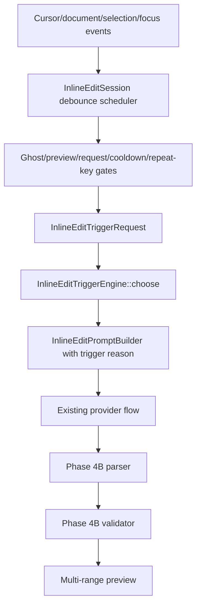

# Kate AI Phase 4C Automatic Next-Edit Suggestions Design

## Background
Phase 4A added manual inline edits. Phase 4B expanded them to safe multi-range edits with validation, non-mutating preview, and transactional bottom-to-top application.

Phase 4C adds automatic next-edit suggestions (NES) for strong local signals: diagnostics near the cursor, recent edit continuation, and explicit selection repair. It reuses the Phase 4A/4B inline edit provider flow and keeps automatic behavior opt-in.

External research notes:
- Editor inline suggestion systems benefit from debounce and cooldown so suggestions use the latest stable context and avoid request floods.
- Diagnostic/code-action UX commonly uses lightweight local filtering near the caret before computing expensive edits.
- Copilot NES UX emphasizes low eagerness, user controls, and clear interaction with ghost suggestions.

## Problem
Manual inline edits require the user to request a repair. The editor already has signals that can indicate a useful next edit: an error under or near the cursor, a repeated recent edit pattern, or a selected region for repair. Automatic NES should surface those opportunities while preserving the existing ghost completion flow and avoiding distracting repeated requests.

## Questions and Answers
- Q: Are automatic inline edits enabled by default?
  - A: No. `enableAutomaticInlineEdits` defaults to false.
- Q: Does manual inline edit behavior change?
  - A: Manual trigger stays available through `enableInlineEdits` and bypasses automatic cooldown.
- Q: Can automatic NES show while ghost completion is visible?
  - A: No. Ghost completion and inline edit preview/request are mutually exclusive.
- Q: Does Phase 4C add symbol analysis or repository indexing?
  - A: No. Heuristics are synchronous, bounded, and local.
- Q: Does Copilot/OpenAI/Ollama provider behavior change?
  - A: No. Automatic NES reuses the existing inline edit request path with low temperature and bounded inline-edit tokens.

## Design

### Architecture


### Trigger Model
Create `src/inlineedit/InlineEditTrigger.h` with:
```cpp
enum class InlineEditTriggerKind {
    Manual,
    DiagnosticRepair,
    RecentEditContinuation,
    SelectionRepair,
};

struct InlineEditTrigger {
    InlineEditTriggerKind kind = InlineEditTriggerKind::Manual;
    QString reason;
    QString sourceUri;
    KTextEditor::Range targetRange = KTextEditor::Range::invalid();
    int priority = 0;
    QString diagnosticMessage;
    QString recentEditSummary;
};

struct InlineEditTriggerRequest {
    QString filePath;
    QString languageId;
    KTextEditor::Cursor cursor;
    KTextEditor::Range selectionRange = KTextEditor::Range::invalid();
    bool hasSelection = false;
    QVector<DiagnosticItem> diagnostics;
    QVector<RecentEdit> recentEdits;
    int documentRevision = 0;
};
```

### Trigger Engine
Create `InlineEditTriggerEngine` as a pure synchronous chooser:
```cpp
class InlineEditTriggerEngine final
{
public:
    [[nodiscard]] static std::optional<InlineEditTrigger> choose(const InlineEditTriggerRequest &request,
                                                                 const CompletionSettings &settings);
};
```

Engine rules:
- Return empty when `enableAutomaticInlineEdits` is false.
- SelectionRepair applies only when `request.hasSelection` and `autoInlineEditSelections` are true.
- DiagnosticRepair applies when diagnostics are enabled, diagnostic automatic triggers are enabled, active-file diagnostic is within `autoInlineEditDiagnosticLineDistance`, severity is error or enabled warning, and no selection exists.
- RecentEditContinuation applies when recent edit automatic triggers are enabled, recent edit context is enabled, edit age is within `autoInlineEditRecentEditWindowMs`, language/path heuristic matches, and no selection exists.
- DiagnosticRepair outranks RecentEditContinuation for the same automatic opportunity.
- Higher priority means selected candidate wins; tie-breakers prefer smaller cursor distance and newer timestamp.

MVP recent-edit heuristic:
- Same language.
- Source URI differs from active file.
- Same directory, sibling basename stem, or shared basename token.
- Active cursor line has distance greater than `recentEditsActiveDocDistanceLimitFromCursor` when the edit came from the active file.

### Scheduling
`InlineEditSession` owns automatic scheduling because it already owns inline-edit request state.

New responsibilities:
- `scheduleAutomaticInlineEdit()` starts a single-shot debounce timer with latest state.
- `cancelPendingAutomaticInlineEdit()` stops the timer.
- `setGhostSuggestionVisible(bool visible)` stores the ghost blocker and cancels pending automatic work when visible.
- `triggerAutomaticInlineEdit()` builds an `InlineEditTriggerRequest`, calls the engine, checks cooldown/repeat key, and starts the existing provider flow with the chosen trigger.
- `triggerInlineEdit()` remains the manual entry point and uses `InlineEditTriggerKind::Manual` or `SelectionRepair` when selection repair setting is enabled.

Cancellation and gating:
- Cursor move, document change, selection change, focus out, provider settings change, visible ghost completion, existing inline edit preview, active inline edit request, and completion popup suppression cancel pending automatic triggers.
- Accept, dismiss, request failure, and invalid automatic response start cooldown.
- Last automatic key is `filePath + cursorLine + kind + sourceUri + diagnostic/recent summary hash`.

### PluginView Coordination
`KateAiInlineCompletionPluginView` connects the two sessions for each view:
- `EditorSession::suggestionVisibilityChanged` updates `InlineEditSession::setGhostSuggestionVisible(session->hasVisibleSuggestion())`.
- Manual inline edit action calls `EditorSession::dismissSuggestion()` before `InlineEditSession::triggerInlineEdit()`.
- Manual ghost trigger action calls `InlineEditSession::cancelPendingAutomaticInlineEdit()` before `EditorSession::triggerSuggestion()`.

### Prompt Builder
`InlineEditPromptBuilder::build()` accepts `InlineEditTrigger` through `InlineEditPromptOptions`.

Prompt additions:
- Manual: keep the current deterministic JSON-only contract.
- DiagnosticRepair:
  - `Trigger reason: DiagnosticRepair`
  - `Diagnostic:` and the sanitized diagnostic message.
- RecentEditContinuation:
  - `Trigger reason: RecentEditContinuation`
  - `Recent edit pattern:` and bounded recent edit summary.
- SelectionRepair:
  - `Trigger reason: SelectionRepair`
  - `Selected code:` and selected text.

Prompt trigger text is bounded by `autoInlineEditMaxPromptChars` and redacted with existing sensitive-data helper where it can contain provider/user text.

### Settings
Add to `CompletionSettings`:
- `enableAutomaticInlineEdits = false`
- `autoInlineEditDebounceMs = 700` bounds `100..5000`
- `autoInlineEditCooldownMs = 5000` bounds `0..60000`
- `autoInlineEditDiagnostics = true`
- `autoInlineEditWarnings = false`
- `autoInlineEditRecentEdits = true`
- `autoInlineEditSelections = false`
- `autoInlineEditDiagnosticLineDistance = 5` bounds `0..100`
- `autoInlineEditRecentEditWindowMs = 300000` bounds `1000..3600000`
- `autoInlineEditMaxPromptChars = 16000` bounds `1000..100000`

UI controls go under Inline Edits:
- Enable automatic inline edits
- Trigger from diagnostics
- Include warnings
- Trigger from recent edits
- Trigger for selections
- Debounce
- Cooldown
- Diagnostic line distance

### Tests
Add `InlineEditTriggerEngineTest` for diagnostic, warning, recent edit, selection repair, disabled automatic setting, and priority order.

Update existing tests:
- `InlineEditPromptBuilderTest`: trigger-specific prompt sections and manual deterministic behavior.
- `InlineEditSessionTest`: automatic diagnostic request, cooldown, cancellation on document/cursor change, ghost blocker, dismiss cooldown, manual trigger bypass.
- `EditorSessionIntegrationTest`: ghost trigger cancels pending automatic edit, manual inline edit clears visible ghost, candidate cycling still works after inline edit dismissal.
- `CompletionSettingsTest`: defaults, validation, load/save.
- `KateAiConfigPageTest`: controls exist, load/apply/reset persistence, child enablement.

## Implementation Plan
1. Add trigger model and pure trigger engine tests first.
2. Implement trigger engine and CMake wiring.
3. Extend prompt builder options and tests for trigger sections.
4. Add settings defaults, validation, load/save, UI controls, and settings/UI tests.
5. Refactor `InlineEditSession` request startup into a shared `startInlineEditRequest(trigger, targetRange, automatic)` helper.
6. Add automatic debounce/cooldown/repeat-key scheduling and session tests.
7. Add `PluginView` ghost/inline-edit coordination and integration tests.
8. Run focused tests after each slice, then full `git diff --check`, build, and `ctest`.
9. Request focused code review and fix blocking findings before push.

## Examples

Diagnostic repair trigger prompt section:
```text
Trigger reason: DiagnosticRepair
Diagnostic:
Fix the diagnostic near the cursor:
missing ';' before '}'
```

Recent edit continuation trigger prompt section:
```text
Trigger reason: RecentEditContinuation
Recent edit pattern:
Continue the recent edit pattern:
Renamed oldName to newName in sibling file.
```

Selection repair trigger prompt section:
```text
Trigger reason: SelectionRepair
Selected code:
Improve or repair the selected code.
```

## Trade-offs
- Automatic NES remains opt-in so existing users keep current behavior.
- Heuristics use local diagnostics/recent-edits data and avoid indexing; precision improves later with semantic symbol analysis.
- Scheduler lives in `InlineEditSession` for request-state locality; `PluginView` handles cross-session ghost coordination.
- Recent-edit continuation is conservative in Phase 4C because cheap path heuristics are safer than broad repository search.

## Implementation Results
Implemented Phase 4C automatic NES triggers in this change.

Changed behavior:
- Added `InlineEditTrigger` and `InlineEditTriggerEngine` for deterministic trigger selection.
- Added diagnostic repair, recent edit continuation, and explicit selection repair trigger reasons.
- Added automatic inline edit debounce, cooldown, repeat-key suppression, ghost blocker, live range validation, and preview/request blockers inside `InlineEditSession`.
- Added `PluginView` coordination so manual ghost trigger cancels pending automatic NES, visible ghost text blocks automatic NES, and manual inline edit trigger clears ghost text first.
- Extended `InlineEditPromptBuilder` with trigger-specific prompt sections while preserving the JSON-only edit contract.
- Added automatic NES settings and compact UI controls under Inline Edits.

Safety fixes during review:
- Reviewer found that automatic diagnostics could carry stale/out-of-bounds ranges.
- Added live document range validation in `InlineEditSession::resolvedTargetRangeForTrigger`.
- Added `InlineEditSessionTest::automaticDiagnosticTriggerRejectsOutOfBoundsDiagnosticRange`.

Focused tests added/updated:
- `InlineEditTriggerEngineTest`
- `InlineEditPromptBuilderTest`
- `InlineEditSessionTest`
- `EditorSessionIntegrationTest`
- `CompletionSettingsTest`
- `KateAiConfigPageTest`

Full verification:
- `git diff --check`
- `cmake --build build -j 8`
- `QT_QPA_PLATFORM=offscreen ctest --test-dir build --output-on-failure`

Result: 33/33 tests passed locally.

Focused re-review result: no blocking findings.
